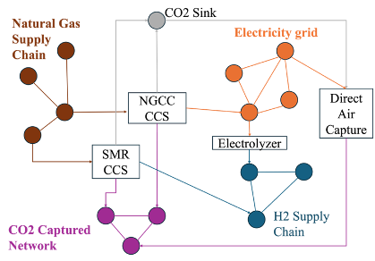

# Overview

MACRO is designed to represent energy systems in a detailed manner, capturing interactions among various sectors and technologies. The system is structured as a **multi-commodity flow network**, with each commodity having independent spatial and temporal scale:

As an example, the figure below illustrates a multi-plex network representing an energy system with electricity, natural gas, and CO2 sectors, with two natural gas power plants, and a solar panel. Blue nodes represent the electricity sector, red nodes represent natural gas, and yellow nodes represent CO2. The edges depict commodity flow, and squares represent transformation points.

As illustrated in the figures above, the core components of the model are:

1. **Vertices**: Represent **balance equations** and can correspond to transformations (linking two or more commodity networks), storage systems, or demand nodes (outflows):
    - **Transformations**: 
        - Special vertices that **convert** one commodity type into another, acting as bridges between sectors. 
        - Representing conversion processes defined by a set of **stoichiometric equations** specifying transformation ratios.
    - **Storage**: 
        - Store commodities for future use.
        - **Storage balance** equations.
    - **Nodes**:
        - Represent geographical locations or zones, each associated with a commodity type.
        - Demand nodes (outflows) or sources (inflows).
        - **Demand balance** equations.
        - They form the network for a specific sector (e.g., electricity network, hydrogen network, etc.).
2. **Edges**: 
    - Depict the **flow** of a commodity into or out of a vertex.
    - Capacity sizing decisions, capex/opex, planning and operational constraints.
3. **Assets**: Defined as a collection of edges and vertices.

Additionally, MACRO includes a **library of assets** and **constraints**, enabling fast and flexible assembly of new technologies and sectors.

## Benders decomposition

MACRO is natively designed to create optimization models ready to be solved using the Benders decomposition framework and [high-performance decomposition algorithms](https://arxiv.org/abs/2403.02559). This allows to solve large-scale problems with several sectors interacting together in a reasonable time frame.

