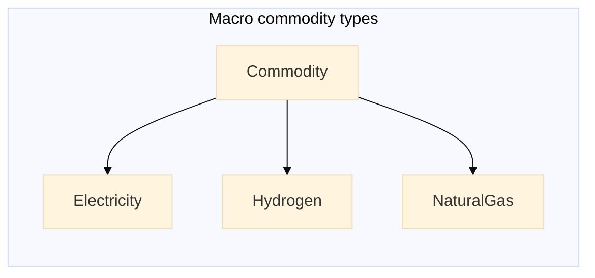

# Creating a New Sector

Creating new sectors in Macro involves two main steps:

1. Choose a **unique name** for the new sector.
2. Add the new sector to the `MacroEnergy.jl` file.

## The `Commodity` Julia Type

!!! tip "Types in Julia"
    If you're not familiar with Julia's type system, we recommend this [section of the Julia documentation](https://docs.julialang.org/en/v1/manual/types/). In particular, for more information on abstract types, see the [Abstract Types](https://docs.julialang.org/en/v1/manual/types/#man-abstract-types) section.

In Macro, the `Commodity` type is an abstract type which defines a generic type used to represent all commodities in the package. Each specific commodity (e.g., electricity, hydrogen) is then defined as a subtype of Commodity:

`MacroEnergy.jl`
```julia
## Commodity types
abstract type Commodity end
abstract type Electricity <: Commodity end
abstract type Hydrogen <: Commodity end
abstract type NaturalGas <: Commodity end
```

Here, the operator `<:` means *is-a-subtype-of*. In this example, both `Electricity` and `Hydrogen` are subtypes of the abstract `Commodity` type.



This diagram shows the type hierarchy in Macro where:
- `Commodity` is the base (abstract) type
- `Electricity`, `Hydrogen`, and `NaturalGas` are all subtypes of `Commodity`
- The arrows show the "is-a-subtype-of" relationship using the `<:` operator

## Adding a new sector to Macro

To define a new sector in Macro, simply add a new line in the `MacroEnergy.jl` file:

`MacroEnergy.jl`
```julia
# ... existing code ...
abstract type MyNewSector <: Commodity end
# ... existing code ...
```

This line defines `MyNewSector` as a new subtype of `Commodity`. Once added, you can create nodes and edges in the energy system graph that correspond to this new sector.

## Next Steps

After defining the new commodity type, you can proceed to build new assets and transformation processes using nodes and edges associated with any `Commodity` type defined in Macro.

- [Creating a New Asset](@ref): Step-by-step instructions for developing a new asset.

- [Creating a New Example Case](@ref): A guide to developing a new example case.