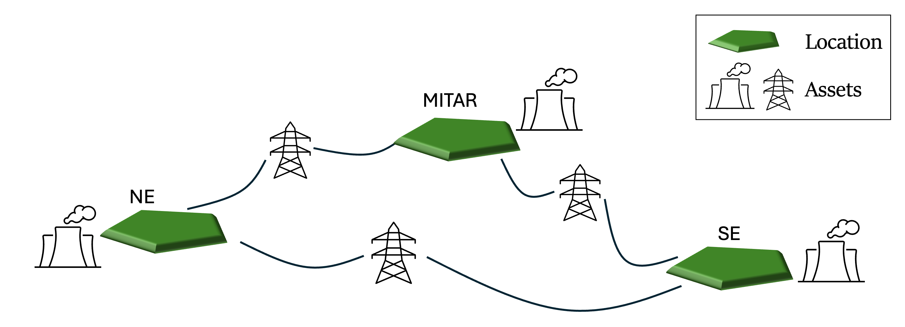
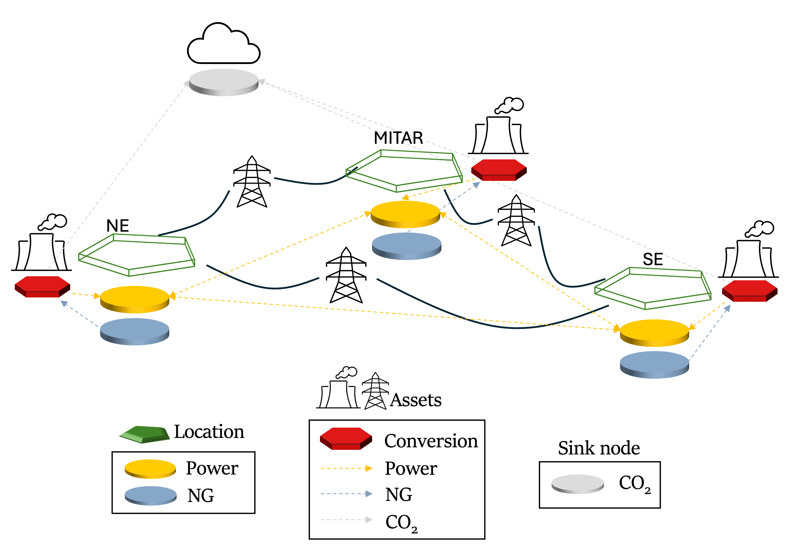

# Energy System Graph-Based Representation

This section of the documentation provides an overview of how **Locations** and **Assets** are internally represented in Macro, to help modelers create new sectors and assets effectively.

## Sector Networks
As mentioned in the [Getting Started](@ref) section, Macro is structured around two main components:

1. **Locations**: Represent geographical areas with some demand or supply for several commodities.
2. **Assets**: Represent means of producing, storing, transporting, and consuming one or more commodities. Each asset can be sited at a specific location.

While this high-level view is useful, modeling new sectors and assets often requires a deeper understanding of how Locations and Assets are internally structured. In Macro, the energy system is modeled as a collection of interconnected **sector networks**. Each sector network includes **nodes** and **edges**:

- **Nodes**: represent the demand or supply for a specific commodity or sector.
- **Edges**: represent the flow of commodities between nodes.

More importantly, sector networks are connected through elements called **transformations**. A transformation is a special type of vertex in the *full* network that connects two or more commodity networks. It represents a physical conversion process, such as an electrolyzer, natural gas power plant, or biorefinery.

So, in the full network, the definitions of Locations and Assets are expanded as follows:

1. **Locations**: Collection of **nodes**, each indicating demand or supply for one or more commodities.
2. **Assets**: Collection of **transformation vertices** representing conversion processes, **storage**, and **edges** connecting nodes across different commodity networks.

Therefore, the high-level figure above can be expanded into the following detailed representation:

This figure illustrates the internal structure of the energy system. Each location is expanded to show sector-specific nodes and edges. Yellow nodes represent demand in the electricity sector, light blue nodes represent natural gas nodes (modeled exogenously in this example), and the grey node represents a CO₂ sink.

The next section outlines the core components of Macro and how they work together to model an energy system.

## Macro Internal Components

As seen in the previous section, an energy system in Macro is composed of the following components:

- **Vertices**: Represent **balance equations**.

    There are three types of vertices in Macro:

    - **Nodes**: Represent demand (outflow) or supply (inflow) of a commodity.

    - **Transformations**: Represent conversion processes. These are special vertices that **convert** one or more commodity types into one or more other types. Each transformation is defined by a set of **stoichiometric equations** specifying conversion ratios.

    - **Storage**: Represent storage systems that hold commodities for future use. The flow of commodities into and out of storage is governed by **storage balance** equations.

- **Edges**: Represent the flow of commodities into or out of a vertex.

    Capacity sizing decisions, CAPEX/OPEX, and both planning and operational constraints are associated with edges.

By combining these components, Macro enables the **fast** and **flexible assembly** of new technologies and sectors.

In the following sections, we’ll describe how to create new sectors and assets, as well as how to debug and test the resulting system.