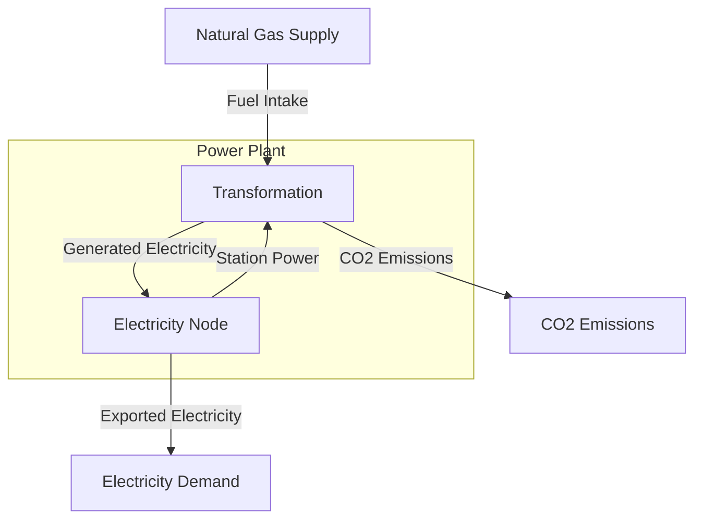

# Nodes

## Contents

[Overview](#overview) | [Fields](#node-fields) | [Types](#types) | [Constructors](#constructors) | [Methods](#methods) | [Examples](#examples)

## Overview

`Nodes` are balance points for flows of a single Commodity. They are one of the four primary components in Macro, alongside `Edges`, `Storage`, and `Transformations`. They are sub-types of the `Vertex` type.

Each `Node` can only balance flows of one Commodity so they are usually described with reference to that Commodity, e.g. as `Node{Electricity}`, `Node{Hydrogen}`, or `Node{CO2}`. The general description is a `Node{T}`, where `T` can be any Commodity or sub-Commodity.

Balances are an important and complicated topic in Macro. They are described in more detail in the [Balances](@ref) section and specific balance constraints can be found in the [Constraints Library](@ref).

### Nodes for System Boundaries

`Nodes` allow for the import and export of Commodities outside a model, making them essential for modeling system boundaries. This capability can be used to represent:

- **Fuel Supplies**: Import of natural gas, coal, or other fuels from external sources
- **Electricity Export**: Export of electricity to neighboring grids or markets
- **Emissions**: Upstream emissions or downstream carbon capture and storage

#### Electricity Node in a regional grid model

An `Node{Electricity}` in a regional electricity model can represent the connection to neighboring grids. The `Node` can have both demand (representing local electricity consumption) and supply capabilities (representing imports from external grids), with associated costs and limits for each.

#### Natural Gas Node in an integrated energy system

A `Node{NaturalGas}` can represent a natural gas supply point where the system can purchase fuel from external suppliers. The supply can have different cost segments, availability constraints, and time-varying prices to represent realistic fuel market conditions.

### Nodes in Locations

Several `Nodes` of different Commodities can be gathered into a `Location`, allowing other components to be connected to them as a group rather than individually. This organizational structure:

- **Simplifies Inputs**: Reduces the complexity of input files by allowing Assets to connect to a Location rather than specifying individual Nodes
- **Intuitive Modelling of Regions**: Represents geographic regions with multiple commodity flows
- **Automative Creation of Nodes**: Macro can automatically create Nodes for each Commodity in a Location when a corresponding `Edge` is connected, simplifying the model setup

For example, a city Location might contain `Node{Electricity}`, `Node{NaturalGas}`, and `Node{Hydrogen}` representing the local infrastructure for each commodity. A power plant Asset can then be connected to this Location, automatically gaining access to all relevant commodity flows.

### Nodes within Assets

`Nodes` can also be used within Assets to merge or split flows of a Commodity or several sub-Commodities. This allows for:

- **Flow Aggregation**: Combining multiple sub-commodity flows into a single commodity flow. For example, a System may track `CleanElectricity` and `FossilElectricity` as sub-commodities of a broader `Electricity` commodity. If part of the System is not concerned with the distinction, a `Node{Electricity}` can aggregate these flows into a single `Electricity` commodity
- **Flow Distribution**: Splitting a single commodity flow into multiple streams which can be used by different Components or other Assets. For example, a `Node{Electricity}` in a power plant Asset might be used to split the generated electricity flow for grid export and station power.

### Key Concepts

- **Single Commodity Balance**: Each Node balances flows of exactly one Commodity type.
- **System Boundaries**: Nodes enable import/export of commodities to/from external systems
- **Demand and Supply**: Nodes can have both demand requirements and supply capabilities
- **Location Grouping**: Multiple Nodes can be organized into Locations for simplified connectivity
- **Flexible Segmentation**: Demand and supply can be segmented with different costs and limits
- **Time Dependence**: Support time-varying demand, supply, and pricing parameters

## Node Fields

`Nodes` have the following fields. When running a model, the fields are set by the input files. When creating an Asset, the defaults below can be altered using the `@node_data` macro. The internal fields are used by Macro and are not intended to be set by users in most circumstances.

!!! note "Units in Macro"
    We have assumed that your System is using units of MWh for energy, tonnes for mass, and hour-long time steps. You can use any set of units as long as they are consistent across your operations and investment inputs.

### Network Structure

| Field            | Type           | Description                 | Default |
|------------------|----------------|-----------------------------|---------|
| `id`             | Symbol         | Unique identifier           | -       |
| `location`       | Union{Missing,Symbol} | Location where node is placed | missing |

### Demand Parameters

| Field                    | Type                      | Description                           | Units    | Default |
|--------------------------|---------------------------|---------------------------------------|----------|---------|
| `demand`                 | Vector{Float64}           | Time-varying demand requirements      |  MWh/hr | Float64[] |
| `max_nsd`                | Vector{Float64}           | Maximum non-served demand by segment  |  MWh/hr | [0.0]   |
| `min_nsd`                | Vector{Float64}           | Minimum non-served demand by segment  |  MWh/hr | [0.0]   |
| `price_nsd`              | Vector{Float64}           | Penalty cost for non-served demand    | $/MWh    | [0.0]   |

### Supply Parameters

| Field                    | Type                      | Description                           | Units    | Default |
|--------------------------|---------------------------|---------------------------------------|----------|---------|
| `max_supply`             | Vector{Float64}           | Maximum supply by segment             |  MWh/hr | [0.0]   |
| `price_supply`           | Vector{Float64}           | Cost of supply by segment             | $/MWh    | [0.0]   |
| `price`                  | Vector{Float64}           | Time-varying commodity prices         | $/MWh    | Float64[] |

### Policy Parameters

| Field                    | Type                      | Description                           | Units    | Default |
|--------------------------|---------------------------|---------------------------------------|----------|---------|
| `price_unmet_policy`     | Dict{Symbol,Any}          | Penalty costs for unmet policy constraints | varies | Dict{Symbol,Any}() |
| `rhs_policy`             | Dict{Symbol,Any}          | Right-hand side values for policy constraints | varies | Dict{Symbol,Any}() |

### Balance and Constraint Tracking (Internal)

| Field                    | Type                      | Description                           | Units    | Default |
|--------------------------|---------------------------|---------------------------------------|----------|---------|
| `balance_data`           | Dict{Symbol,Dict{Symbol,Float64}} | Balance equation coefficients | -    | Dict{Symbol,Dict{Symbol,Float64}}() |
| `constraints`            | Vector{AbstractTypeConstraint} | Additional constraints        | -        | Vector{AbstractTypeConstraint}() |
| `operation_expr`         | Dict                      | Operational JuMP expressions          | -        | Dict() |

### Operational Variables (Internal)

| Field                    | Type                      | Description                           | Units    | Default |
|--------------------------|---------------------------|---------------------------------------|----------|---------|
| `non_served_demand`      | JuMPVariable              | Non-served demand variables           |  MWh/hr | Matrix{VariableRef}(undef, 0, 0) |
| `supply_flow`            | JuMPVariable              | Supply flow variables                 |  MWh/hr | Matrix{VariableRef}(undef, 0, 0) |
| `policy_budgeting_vars`  | Dict                      | Policy constraint budgeting variables | varies   | Dict() |
| `policy_slack_vars`      | Dict                      | Policy constraint slack variables     | varies   | Dict() |

## Types

### Node{T}

Concrete implementation of a network node parameterized by commodity type `T`.

## Constructors

### Keyword Constructors

Nodes can be constructed by providing some or all of the fields described above as keyword arguments. The following constructors are available, where `T` is the type of commodity flowing through the Node, e.g. `Electricity`, `NaturalGas`, etc.

```julia
Node{T::Commodity}(; id::Symbol, timedata::TimeData, [additional_fields...])
```

### Outer Constructors

Nodes can also be constructed using a dictionary containing most of their configuration data. These call the underlying `make_node()` function. This approach is useful when creating Assets or when reading from input files. The following constructors are available:

```julia
Node(data::AbstractDict{Symbol,Any}, time_data::TimeData, commodity::DataType)
```

| Parameter    | Type                       | Description                           |
|--------------|----------------------------|---------------------------------------|
| `data`       | AbstractDict{Symbol,Any}   | Dictionary of node configuration data |
| `time_data`  | TimeData                   | Time-related data structure           |
| `commodity`  | DataType                   | Commodity type for the node           |

## Methods

### Accessor Methods

Methods for accessing node data and properties.

| Method | Description | Return Type |
|--------|-------------|-------------|
| `id(n::Node)` | Get node identifier | `Symbol` |
| `commodity_type(n::Node{T})` | Get commodity type parameter | `DataType` |
| `demand(n::Node)` | Get full demand vector | `Vector{Float64}` |
| `demand(n::Node, t::Int64)` | Get demand at time period t | `Float64` |
| `price(n::Node)` | Get full price vector | `Vector{Float64}` |
| `price(n::Node, t::Int64)` | Get price at time period t | `Float64` |

### Demand and Non-Served Demand Methods

Methods for managing demand requirements and non-served demand.

| Method | Description | Return Type |
|--------|-------------|-------------|
| `max_non_served_demand(n::Node)` | Get maximum non-served demand by segment | `Vector{Float64}` |
| `max_non_served_demand(n::Node, s::Int64)` | Get maximum non-served demand for segment s | `Float64` |
| `non_served_demand(n::Node)` | Get non-served demand variables | `JuMPVariable` |
| `non_served_demand(n::Node, s::Int64, t::Int64)` | Get non-served demand for segment s at time t | `VariableRef` |
| `price_non_served_demand(n::Node)` | Get penalty prices for non-served demand | `Vector{Float64}` |
| `price_non_served_demand(n::Node, s::Int64)` | Get penalty price for non-served demand segment s | `Float64` |
| `segments_non_served_demand(n::Node)` | Get range of non-served demand segments | `UnitRange{Int64}` |

### Supply Methods

Methods for managing supply capabilities and flows.

| Method | Description | Return Type |
|--------|-------------|-------------|
| `max_supply(n::Node)` | Get maximum supply by segment | `Vector{Float64}` |
| `max_supply(n::Node, s::Int64)` | Get maximum supply for segment s | `Float64` |
| `supply_flow(n::Node)` | Get supply flow variables | `JuMPVariable` |
| `supply_flow(n::Node, s::Int64, t::Int64)` | Get supply flow for segment s at time t | `VariableRef` |
| `price_supply(n::Node, s::Int64)` | Get supply price for segment s | `Float64` |
| `supply_segments(n::Node)` | Get range of supply segments | `Base.OneTo{Int64}` |

### Policy Methods

Methods for managing policy constraints and variables.

| Method | Description | Return Type |
|--------|-------------|-------------|
| `policy_budgeting_vars(n::Node)` | Get policy budgeting variables | `Dict` |
| `policy_slack_vars(n::Node)` | Get policy slack variables | `Dict` |
| `price_unmet_policy(n::Node)` | Get penalty prices for unmet policy constraints | `Dict{DataType,Float64}` |
| `price_unmet_policy(n::Node, c::DataType)` | Get penalty price for unmet policy constraint of type c | `Float64` |
| `rhs_policy(n::Node)` | Get right-hand side values for policy constraints | `Dict{DataType,Float64}` |
| `rhs_policy(n::Node, c::DataType)` | Get right-hand side value for policy constraint of type c | `Float64` |

### Balance and Constraint Methods (Inherited from AbstractVertex)

Methods for managing balance equations and constraints.

| Method | Description | Return Type |
|--------|-------------|-------------|
| `balance_ids(n::Node)` | Get IDs of all balance equations | `Vector{Symbol}` |
| `balance_data(n::Node, i::Symbol)` | Get input data for balance equation i | `Dict{Symbol,Float64}` |
| `get_balance(n::Node, i::Symbol)` | Get balance equation expression for i | `JuMP.Expression` |
| `get_balance(n::Node, i::Symbol, t::Int64)` | Get balance equation expression for i at time t | `JuMP.Expression` |
| `all_constraints(n::Node)` | Get all constraints applied to the node | `Vector{AbstractTypeConstraint}` |
| `all_constraints_types(n::Node)` | Get types of all constraints | `Vector{DataType}` |
| `get_constraint_by_type(n::Node, constraint_type)` | Get constraint of specified type | `AbstractTypeConstraint` |

### Model Building Methods

Methods used internally during model construction.

| Method | Description | Return Type |
|--------|-------------|-------------|
| `add_linking_variables!(n::Node, model::Model)` | Add linking variables to JuMP model | `Nothing` |
| `define_available_capacity!(n::Node, model::Model)` | Define available capacity constraints | `Nothing` |
| `planning_model!(n::Node, model::Model)` | Add planning model constraints | `Nothing` |
| `operation_model!(n::Node, model::Model)` | Add operational model constraints | `Nothing` |

### Utility Methods

Additional utility methods for working with Nodes.

| Method | Description | Return Type |
|--------|-------------|-------------|
| `get_nodes_sametype(nodes::Vector{Node}, commodity::DataType)` | Filter nodes by commodity type | `Vector{Node}` |
| `make(commodity::Type{<:Commodity}, input_data, system)` | Factory method for creating nodes | `Node{T}` |

## Examples

### Nodes in Node list

The most common way to use Nodes is to add them to the list of Nodes in your Macro System. The Node list is most commonly stored in the `system/nodes.json` file. The Commodity of each Node is defined by the `type` field, then further parameters can be given in the `instance_data` field or `global_data` field if defining several Nodes of the same type. Each Node must have a unique `id` which is used to identify the Node in the System and Model.

#### Electricity Nodes with non-served demand

In this example, we'll define two Electricity Nodes with non-served demand (NSD) limits. NSD limits are defined by:

1. Providing a vector of demand segments in the `max_nsd` field. Each segment is the fraction of this Nodes's demand that can be met by NSD each time step. A value of `[1.0]` indicated that the entire demand can be non-served.  
2. Providing a vector of prices in the `price_nsd` field, of the same length as the `max_nsd` field. Each segment is the price per MWh of non-served demand for the corresponding segment. Here, we have defined a NSD price of $5000/MWh.
3. We have to add a `MaxNonServedDemandConstraint` constraint to the `constraints` field to enfore the NSD limit. If we wish to use multiple segments, we also need to add a `MaxNonServedDemandPerSegmentConstraint` constraint.

We want both Nodes to have the same NSD limits, so we can define these in the `global_data` field. To define different limits or prices, we could move the `max_nsd` and / or `price_nsd` fields to the `instance_data` field of each Node.

Both Nodes have exogenous Electricity demand, which is defined in the `demand` field. You could simply provide the data as an array of Float64 values but here we have used the `timeseries` feature to instead load the demand from a different file, in this case `system/demand.csv`. The `header` field specifies the column in the CSV file to use for each Node's demand.

Lastly, we have added `location` fields to both Nodes. This is not required but will allow other components to connect to these Nodes by Location rather than by Node ID. This can simplify model inputs and connectivity. Each Location can only have one Node of each Commodity or Sub-Commodity and Macro will throw an error if you try to add a second Node of the same Commodity to a Location.

```json
{
    "nodes": [
        {
            "type": "Electricity",
            "global_data": {
                "global_data": {
                    "time_interval": "Electricity",
                    "max_nsd": [1.0],
                    "price_nsd": [5000.0],
                    "constraints": {
                        "BalanceConstraint": true,
                        "MaxNonServedDemandConstraint": true,
                        "MaxNonServedDemandPerSegmentConstraint": true
                    }
                }
            },
            "instance_data": [
                {
                    "id": "boston_electricity",
                    "location": "boston",
                    "demand": {
                        "timeseries": {
                            "path": "system/demand.csv",
                            "header": "Demand_Boston"
                        }
                    }
                },
                {
                    "id": "princeton_electricity",
                    "location": "princeton",
                    "demand": {
                        "timeseries": {
                            "path": "system/demand.csv",
                            "header": "Demand_Princeton"
                        }
                    }
                }
            ]
        }
    ]
}
```

#### Biomass Node with Supply Segments

Nodes can also be used to supply Commodities from outside your System. Here, we define two Biomass Nodes which are used to supply biomass to the System for use as fuel. As in the previous example, we have used a mixture of `global_data` and `instance_data` to define the Nodes. We have also added both to Locations so that other components can connect to them by Location rather than by Node ID.

Adding external supply is similar to adding demand, but we use the `max_supply` and `price_supply` fields and there is no need to add constraints beyong the basic `BalanceConstraint`. The `max_supply` field is a vector of the maximum number of units which can be supplied each time step for each segment. These are individual segments of supply, not cumulative supply. The `price_supply` field is a vector of prices per unit for each segment. We recommend listing the segments in order of increasing price. This is not necessary for Macro to handle them correctly but will make the results easier to interpret.

```json
{
    "type": "Biomass",
    "global_data": {
        "time_interval": "Biomass",
        "constraints": {
            "BalanceConstraint": true
        }
    },
    "instance_data": [
        {
            "id": "boston_bioherb",
            "location": "boston",
            "max_supply": [
                3000.0,
                1000.0,
                2000.0
            ],
            "price_supply": [
                80.0,
                100.0,
                150.0
            ]
        },
        {
            "id": "princeton_bioherb",
            "location": "princeton",
            "max_supply": [
                500.0,
                3000.0,
                1000.0
            ],
            "price_supply": [
                80.0,
                100.0,
                150.0
            ]
        }
    ]
}           
```

#### Emissions Nodes

Tracking and constraining emissions is an important part of many energy system models. In Macro, you can create Commodity flows of the emissions you wish to track. It is common to have these flows meet at one or more Nodes to track total emissions and apply constraints to them.

Here we define a `co2_sink` Node which we will use to track all `CO2` emissions in our System. We have added a `CO2CapConstraint` and set its right-hand side (RHS) value to 0, meaning the CO2 flows at this Node must net to zero over the period of operations.

Becasue this is a common way to formulate emissions tracking, we have made the `co2_sink` ID a special case in Macro. Most emitting Assets have the ability to automatically connect their `Edge{CO2}` emissions flows to a `co2_sink` Node if it exists in the System.

In this example we have also added to Nodes to allow for captured CO2 to be sequestered. These `Node{CO2Captured}` Nodes have `CO2StorageConstraint` constraints which allow and limit the tonnes of CO2 that can be injected into each Node annually. The `rhs_policy` field sets the annual limit for each Node, in this case 4,753,600 tonnes for Boston and 5,145,400 tonnes for Princeton.

Sequestration could be modelled using a `Storage{CO2}` component but `Storage` components are required to have zero net stored flow over the period of operations. This means that the `Storage` component would not allow for a net injection of CO2 into the Node, which is what we want to model here.

```json
{
    "type": "CO2",
    "global_data": {
        "time_interval": "CO2"
    },
    "instance_data": [
        {
            "id": "co2_sink",
            "constraints": {
                "CO2CapConstraint": true
            },
            "rhs_policy": {
                "CO2CapConstraint": 0
            }
        }
    ]
}

```json
{
    "type": "CO2",
    "global_data": {
        "time_interval": "CO2"
    },
    "instance_data": [
        {
            "id": "co2_sink",
            "constraints": {
                "CO2CapConstraint": true
            },
            "rhs_policy": {
                "CO2CapConstraint": 0
            }
        }
    ]
}

```json
{
    "nodes": [
        {
            "type": "CO2",
            "global_data": {
                "time_interval": "CO2"
            },
            "instance_data": [
                {
                    "id": "co2_sink",
                    "constraints": {
                        "CO2CapConstraint": true
                    },
                    "rhs_policy": {
                        "CO2CapConstraint": 0
                    }
                }
            ]
        },
        {
            "type": "CO2Captured",
            "global_data": {
                "time_interval": "CO2Captured"
            },
            "instance_data": [
                {
                    "id": "boston_co2_storage",
                    "location": "boston",
                    "constraints": {
                        "CO2StorageConstraint": true
                    },
                    "rhs_policy": {
                        "CO2StorageConstraint": 4753600
                    }
                },
                {
                    "id": "princeton_co2_storage",
                    "location": "princeton",
                    "constraints": {
                        "CO2StorageConstraint": true
                    },
                    "rhs_policy": {
                        "CO2StorageConstraint": 5145400
                    }
                }
            ]
        }
    ]
}
```

### Nodes in Assets

Nodes can be added to Assets to allow for the merging or splitting of Commodity flows. This is useful when you want to aggregate multiple sub-commodities into a single commodity flow or distribute a single commodity flow into multiple streams. Nodes are not as commonly used in Assets as the other components. In many instances you will prefer to merge or split flows between Assets.

The [Modellers guide on creating Assets](@ref "Creating a New Asset") provides a detailed overview of how to create Assets and add Nodes to them. Below is a brief example of how to use Nodes within an Asset.

#### Natual Gas Power Plant with Station Power

In this example, we create a `StationPowerExample` Asset representing a natural gas power plant with station power requirements. Station power is usually accounted for by the `Transformation` component. The stochiometric balance between the fuel and exported electricity flows will include the station power required to run the pumps, compressors, and other equipment at the plant.

In this case, we will explicitly track the station power using an `Edge{Electricity}` connected to a `Node{Electricity}`. We will add the station power edge as an incoming Edge to the `Transformation`. The stochiometric balance will be used to control the station power required. In the future, we could use the Node to add a fixed station power demand on top of the output-dependent station power.



```julia
struct StationPowerExample <: AbstractAsset
    id::AssetId
    thermal_transform::Transformation
    elec_node::Node{<:Electricity}
    generated_elec_edge::Union{Edge{<:Electricity},EdgeWithUC{<:Electricity}}
    station_elec_edge::Edge{<:Electricity}
    exported_elec_edge::Edge{<:Electricity}
    fuel_edge::Edge{<:T}
    co2_edge::Edge{<:CO2}
end>

# You will need to define additional constructors and the default inputs here

function make(asset_type::Type{StationPowerExample}, data::AbstractDict{Symbol,Any}, system::System)
    id = AssetId(data[:id])
    @setup_data(asset_type, data, id)

    thermal_key = :transforms
    # ... setup and create the Transformation

    elec_node_key = :elec_node
    @process_data(
        elec_node_data, 
        data[:nodes][elec_node_key], 
        [
            (data[:nodes][elec_node_key], key),
            (data[:nodes][elec_node_key], Symbol("elec_node_", key)),
            (data, Symbol("elec_node_", key)),
        ]
    )
    elec_node_data[:id] = Symbol(id, "_", elec_node_key)
    elec_node = Node(
        elec_node_data,
        system.timedata[:Electricity],
        Electricity
    )

    generated_elec_key = :generated_elec_edge
    # ... create an Edge{Electricity} between the Transformation and the Electricity Node

    station_elec_key = :station_elec_edge
    # ... create an Edge{Electricity} for the station power, connecting the Node to the Transformation

    exported_elec_key = :exported_elec_edge
    # ... create an Edge{Electricity} for the electricity export, connecting the Node to the external demand

    fuel_key = :fuel_edge
    # ... create an Edge{NaturalGas} for the fuel supply, connecting the fuel Node to the Transformation

    co2_key = :co2_edge
    # ... create an Edge{CO2} for the CO2 emissions, connecting the Transformation to the CO2 sink Node

    # ... set up the stochiometric balance between the fuel, station power, and generated electricity flows

    return StationPowerExample(
        id,
        thermal_transform,
        elec_node,
        generated_elec_edge,
        station_elec_edge,
        exported_elec_edge,
        fuel_edge,
        co2_edge
    )
end
```

Using the default JSON input format and carefully chosen defaults, our new Asset will only require one additional field specifying the station power required per unit of fuel or MWh of electricity generated. The creation and connection of the Node will be handled by the `make()` function. Here, we've used the latter by creating a `station_power_per_MWh` field. This must be accessed and added to the stochiometric balance in the `make()` function.

```json
{
    "type": "StationPowerExample",
    "global_data": {},
    "instance_data": {
        "id": "example_natural_gas_power_plant",
        "location": "boston",
        "timedata": "NaturalGas",
        "fuel_commodity": "NaturalGas",
        "co2_sink": "co2_sink",
        "uc": true,
        "elec_constraints": {
            "CapacityConstraint": true,
            "RampingLimitConstraint": true,
            "MinFlowConstraint": true,
            "MinUpTimeConstraint": true,
            "MinDownTimeConstraint": true,
        },
        "emission_rate": 0.181048235160161,
        "fuel_consumption": 2.249613533,
        "station_power_per_MWh": 0.05,
        "can_expand": false,
        "existing_capacity": 4026.4,
        "investment_cost": 0.0,
        "fixed_om_cost": 16001,
        "variable_om_cost": 4.415,
        "capacity_size": 125.825,
        "startup_cost": 89.34,
        "startup_fuel_consumption": 0.58614214,
        "min_up_time": 6,
        "min_down_time": 6,
        "ramp_up_fraction": 0.64,
        "ramp_down_fraction": 0.64,
        "min_flow_fraction": 0.444
    }
}
```

The advanced JSON inputs will require additional fields to specify the Node and additional Edges. The `make()` function will handle the internal connections. These inputs could be significantly simplified by improving the default values for the fields using the `full_default_data()` function.

```json
{
    "type": "ThermalPower",
    "global_data": {},
    "instance_data": {
        "id": "example_natural_gas_power_plant",
        "transforms": {
            "emission_rate": 0.181048235160161,
            "fuel_consumption": 2.249613533,
            "station_power_per_MWh": 0.05,
        },
        "nodes": {
            "elec_node": {
                "commodity": "Electricity",
                "timedata": "Electricity",
                "constraints": {
                    "BalanceConstraint": true
                },
            }
        },
        "edges": {
            "exported_elec": {
                "commodity": "Electricity",
                "unidirectional": true,
                "has_capacity": true,
                "uc": true,
                "integer_decisions": false,
                "constraints": {
                    "CapacityConstraint": true,
                    "RampingLimitConstraint": true,
                    "MinFlowConstraint": true,
                    "MinUpTimeConstraint": true,
                    "MinDownTimeConstraint": true
                },
               "end_vertex": "boston_elec",
                "can_retire": true,
                "can_expand": false,
                "existing_capacity": 4026.4,
                "investment_cost": 0.0,
                "fixed_om_cost": 16001,
                "variable_om_cost": 4.415,
                "capacity_size": 125.825,
                "startup_cost": 89.34,
                "startup_fuel_consumption": 0.58614214,
                "min_up_time": 6,
                "min_down_time": 6,
                "ramp_up_fraction": 0.64,
                "ramp_down_fraction": 0.64,
                "min_flow_fraction": 0.444
            },
            "generated_elec_edge": {
                "commodity": "Electricity",
                "unidirectional": true,
                "has_capacity": false
            },
            "station_elec_edge": {
                "commodity": "Electricity",
                "unidirectional": true,
                "has_capacity": false
            },
            "fuel_edge": {
                "commodity": "NaturalGas",
                "unidirectional": true,
                "has_capacity": false,
                "start_vertex": "boston_natgas"
            },
            "co2_edge": {
                "commodity": "CO2",
                "unidirectional": true,
                "has_capacity": false,
                "end_vertex": "co2_sink"
            }
        }
    }
}
```

## See Also

- [Edges](@ref) - Components that connect Vertices and carry flows
- [Transformations](@ref) - Processes that transform flows between edges
- [Storage](@ref) - Energy storage components that can be connected to edges
- [Vertices](@ref) - Network nodes that edges connect
- [Assets](@ref "Assets") - Higher-level components made from edges, nodes,
- [Commodities](@ref) - Types of resources flowing through edges  
- [Time Data](@ref) - Temporal modeling framework
- [Constraints](@ref) - Additional constraints for edges
