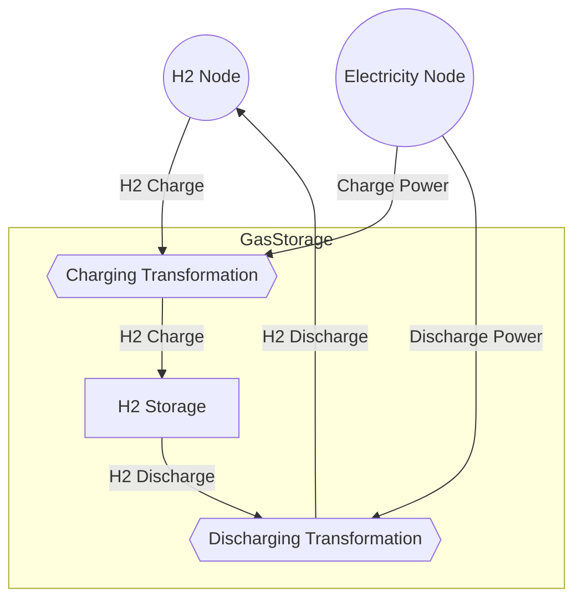

# Storage

## Contents

[Overview](#overview) | [Fields](#storage-fields) | [Types](#types) | [Constructors](#constructors) | [Methods](#methods) | [Examples](#examples)

## Overview

`Storage` components store commodities over time, allowing for intertemporal energy management and system flexibility. They are one of the four primary components in Macro, alongside `Nodes`, `Edges`, and `Transformations`. They are sub-types of the `Vertex` type.

Each `Storage` can only handle flows of one Commodity so they are usually described with reference to that Commodity, e.g. as `Storage{Electricity}`, `Storage{Hydrogen}`, or `Storage{Heat}`. The general description is a `Storage{T}`, where `T` can be any Commodity or sub-Commodity.

### Storage in Assets

`Storage{T}` components are incorporated into Assets, representing the ability of those Assets to store and release Commodities over time. This is particularly important for modeling :

- **Battery Storage**: Electricity storage with charging and discharging capabilities
- **Pumped Hydro**: Large-scale electricity storage using water reservoirs
- **Compressed Air Energy Storage (CAES)**: Mechanical energy storage systems
- **Hydrogen Storage**: Chemical energy storage for fuel cells and industrial processes
- **Heat Storage**: Thermal energy storage for district heating systems

#### Battery Storage Asset

A battery storage Asset can be modeled as a `Storage{Electricity}` component connected to the other Electricity components through charging and discharging `Edges`. The `Storage` component tracks the state of charge of the system, including losses, while the `Edges` handle the power flows in and out of the battery, each potentially with different efficiencies and capacity limits.

#### Hydrogen Storage Asset

A hydrogen storage Asset is a more complex Asset, as it requires `Electricity` flows to run the pumps and compressors necessary to charge and discharge the `Storage{Hydrogen}`.  This is achieved by connecting the `Storage{Hydrogen}` to `Electricity` and `Hydrogen` flows via `Transformation` components that convert between the two commodities. The `Storage{Hydrogen}` component itself manages the state of charge, losses, and capacity limits for hydrogen storage.

#### Long Duration Storage

Many Macro models make use of representative periods to reduce the computational burden of modeling long time horizons. Under their ordinary balance Constraints, the state of charge of `Storage` components will be cyclic across each representative period, i.e. there will be zero net change in the state of charge. This ensures that the System does not have access to "free" mass or energy by preventing situations where the initial state of charge is greater than zero and the final state of charge is allowed to be zero.

While single period cycles are fine for storage which usually discharge within those periods, for example grid-scale Li-ion batteries with one week representative periods, they are not suitable for long duration storage systems that may discharge over multiple representative periods, such as seasonal storage systems. `LongDurationStorage` components are used to represent storage systems that operate across these representative periods, allowing for seasonal energy storage and inter-period coordination. The state of charge of `LongDurationStorage` components is tracked across the representative periods, ensuring that the energy balance is maintained over the entire modeling horizon.

### Storage Outside of Assets

`Storage` components can be used outside of Assets but there is no standard inputs file to do so currently. Most Users will be better served by using `Storage` components within Assets, as this allows for more complex interactions and configurations. However, it is possible to define `Storages` directly in the Julia script you use to build and solve your model. Please feel free to reach out to the developemnt team via a GitHub issue if you have a use case for this.

### Key Concepts

- **Single Commodity Storage**: Each Storage component handles one Commodity type
- **Temporal Energy Management**: Storage enables shifting energy demand and supply across time
- **State of Charge Tracking**: Storage track their time-dependent state of charge
- **Capacity Limits**: Unlike Nodes and Transformations, Storage have capacity limits on the energy and mass they can hold. They do not have charge and discharge limits. Those are handled by the Edges that connect to the Storage.
- **Capacity Investment**: Storage capacity can be fixed or expandable through investment
- **Loss Modeling**: Storage losses are typically modelled as a percentage of the energy or mass stored, impacting the state of charge over time
- **Cyclic Operation**: Storage state loops across modeling periods to ensure conservation of energy and mass
- **Long Duration Storage**: Storage can be configured to track state of charge across multiple representative periods, enabling seasonal storage within Systems using representative periods

## Storage Fields

`Storage` components have the following fields. When running a model, the fields are set by the input files. When creating an Asset, the defaults below can be altered using the `@storage_data` macro. The internal fields are used by Macro and are not intended to be set by users in most circumstances.

!!! note "Units in Macro"
    In the tables below, we have assumed that the Storage component compoent in question is storing energy, such as electricity or heat. Therefore the unit of storage is MWh. Please swap these for tonnes or other units as appropriate for your use case. We have also assumed that your System is using hour-long time steps. You can use any set of units as long as they are consistent across your operations and investment inputs.

### Network Structure

| Field            | Type           | Description                 | Default |
|------------------|----------------|-----------------------------|---------|
| `id`             | Symbol         | Unique identifier           | -       |
| `location`       | Union{Missing,Symbol} | Location where storage is placed | missing |
| `commodity`      | Type           | Commodity type being stored | -       |

### Storage Configuration

| Field                    | Type                      | Description                           | Units    | Default |
|--------------------------|---------------------------|---------------------------------------|----------|---------|
| `charge_edge`            | Union{Nothing,AbstractEdge} | Edge representing charging flow     | -        | missing |
| `discharge_edge`         | Union{Nothing,AbstractEdge} | Edge representing discharging flow  | -        | missing |
| `spillage_edge`          | Union{Nothing,AbstractEdge} | Edge for spillage/waste flows       | -        | missing |
| `charge_discharge_ratio` | Float64                   | Ratio between charge and discharge rates | -    | 1.0     |
| `long_duration`          | Bool                      | Whether to use long duration storage | -        | false   |

### Investment Parameters

| Field                    | Type                      | Description                           | Units    | Default |
|--------------------------|---------------------------|---------------------------------------|----------|---------|
| `can_expand`             | Bool                      | Whether capacity can be expanded      | -        | true    |
| `can_retire`             | Bool                      | Whether capacity can be retired       | -        | true    |
| `existing_capacity`      | Float64                   | Initial installed capacity            | MWh      | 0.0     |
| `max_capacity`           | Float64                   | Maximum total capacity                | MWh      | Inf     |
| `min_capacity`           | Float64                   | Minimum total capacity                | MWh      | 0.0     |
| `max_new_capacity`       | Float64                   | Maximum new capacity additions        | MWh      | Inf     |
| `capacity_size`          | Float64                   | Unit size for capacity decisions      | MWh      | 1.0     |

### Economic Parameters

| Field                    | Type                      | Description                           | Units    | Default    |
|--------------------------|---------------------------|---------------------------------------|----------|------------|
| `investment_cost`        | Float64                   | CAPEX per unit capacity               | $/MWh    | 0.0        |
| `annualized_investment_cost` | Union{Nothing,Float64} | Annualized CAPEX                     | $/MWh/yr | calculated |
| `fixed_om_cost`          | Float64                   | Fixed O&M costs                       | $/MWh/yr | 0.0        |
| `variable_om_cost`       | Float64                   | Variable O&M costs                    | $/MWh    | 0.0        |
| `wacc`                   | Float64                   | Weighted average cost of capital      | fraction | 0.0        |
| `lifetime`               | Int                       | Asset lifetime in years               | years    | 1          |
| `capital_recovery_period` | Int                      | Investment recovery period            | years    | 1          |
| `retirement_period`      | Int                       | Retirement period                     | years    | 0          |

### Operational Parameters

| Field                    | Type                      | Description                           | Units    | Default  |
|--------------------------|---------------------------|---------------------------------------|----------|----------|
| `min_duration`           | Float64                   | Minimum storage duration              | hours    | 0.0      |
| `max_duration`           | Float64                   | Maximum storage duration              | hours    | 0.0      |
| `min_storage_level`      | Float64                   | Minimum storage level (fraction)      | fraction | 0.0      |
| `max_storage_level`      | Float64                   | Maximum storage level (fraction)      | fraction | 0.0      |
| `min_outflow_fraction`   | Float64                   | Minimum discharge rate (fraction)     | fraction | 0.0      |
| `loss_fraction`          | Vector{Float64}           | Storage losses per timestep           | fraction | Float64[]|

### Balance and Constraint Tracking (Internal)

| Field                    | Type                      | Description                           | Units    | Default |
|--------------------------|---------------------------|---------------------------------------|----------|---------|
| `balance_data`           | Dict{Symbol,Dict{Symbol,Float64}} | Balance equation coefficients | -    | Dict{Symbol,Dict{Symbol,Float64}}() |
| `constraints`            | Vector{AbstractTypeConstraint} | Additional constraints        | -        | Vector{AbstractTypeConstraint}() |
| `operation_expr`         | Dict                      | Operational JuMP expressions          | -        | Dict() |

### Investment and Operations Tracking (Internal)

| Field                    | Type                      | Description                           | Units    | Default |
|--------------------------|---------------------------|---------------------------------------|----------|---------|
| `capacity`               | Union{AffExpr,Float64}    | Total available capacity              | MWh      | -       |
| `new_capacity`           | JuMPVariable              | New capacity investments              | MWh      | -       |
| `new_capacity_track`     | Dict{Int,Float64}         | Capacity additions by period          | MWh      | -       |
| `retired_capacity`       | JuMPVariable              | Capacity retirements                  | MWh      | -       |
| `retired_capacity_track` | Dict{Int,Float64}         | Retirements by period                 | MWh      | -       |
| `new_units`              | Union{Missing,JuMPVariable} | New unit installations              | units    | -       |
| `retired_units`          | Union{Missing,JuMPVariable} | Unit retirements                   | units    | -       |
| `storage_level`          | Vector{VariableRef}       | Storage level at each timestep        | MWh      | -       |

### Long Duration Storage Tracking (LongDurationStorage only, Internal)

| Field                    | Type                      | Description                           | Units    | Default |
|--------------------------|---------------------------|---------------------------------------|----------|---------|
| `storage_initial`        | Union{JuMPVariable,Dict{Int64,Float64}} | Initial storage level by period | MWh | Vector{VariableRef}() |
| `storage_change`         | Union{JuMPVariable,Dict{Int64,Float64}} | Storage change by period        | MWh | Vector{VariableRef}() |

## Types

### Type Hierarchy

`Storage` types follow a hierarchical structure rooted in the abstract `AbstractVertex` type:

```julia
AbstractVertex
├── Node{T}
├── AbstractStorage{T}
│   ├── Storage{T}
│   └── LongDurationStorage{T}
└── Transformation{T}
```

Where `T` is a Commodity type parameter that specifies which commodity the Storage handles.

### AbstractStorage{T}

Abstract supertype for all storage types, parameterized by commodity type `T`. Provides common functionality for:

- Unique identification (`id`)
- Time-based data management (`timedata`)
- Balance equation handling (`balance_data`)
- Constraint management (`constraints`)
- Operational expressions (`operation_expr`)
- Storage-specific operations (charging, discharging, capacity management)

### Storage{T}

Standard storage implementation for short-term storage that operates within representative periods.

### LongDurationStorage{T}

Extended storage implementation for long-term storage that operates across multiple representative periods.

## Constructors

### Keyword Constructors

```julia
Storage{T}(; id::Symbol, timedata::TimeData, [additional_fields...])

LongDurationStorage{T}(; id::Symbol, timedata::TimeData, [additional_fields...])
```

Direct constructors using keyword arguments for all fields.

| Parameter   | Type                         | Description                           | Required |
|-------------|------------------------------|---------------------------------------|----------|
| `id`        | Symbol                       | Unique identifier                     | Yes      |
| `timedata`  | TimeData                     | Time-related data structure           | Yes      |
| `charge_edge` | Union{Nothing,AbstractEdge} | Edge for charging flows               | No       |
| `discharge_edge` | Union{Nothing,AbstractEdge} | Edge for discharging flows         | No       |
| `existing_capacity` | Float64               | Initial installed capacity            | No       |
| `max_capacity` | Float64                   | Maximum storage capacity              | No       |
| `loss_fraction` | Vector{Float64}          | Storage loss rates                    | No       |
| `...`       | Various                      | Additional storage-specific fields    | No       |

### Primary Constructors

```julia
Storage(id::Symbol, data::Dict{Symbol,Any}, time_data::TimeData, commodity::DataType)

LongDurationStorage(id::Symbol, data::Dict{Symbol,Any}, time_data::TimeData, commodity::DataType)
```

Creates Storage components from input data dictionary, time data, and commodity type.

| Parameter    | Type                       | Description                              |
|--------------|----------------------------|------------------------------------------|
| `id`         | Symbol                     | Unique identifier for the storage        |
| `data`       | Dict{Symbol,Any}           | Dictionary of storage configuration data |
| `time_data`  | TimeData                   | Time-related data structure              |
| `commodity`  | DataType                   | Commodity type for the storage           |

### Factory Constructors

```julia
make_storage(id::Symbol, data::Dict{Symbol,Any}, time_data::TimeData, commodity::DataType)

make_long_duration_storage(id::Symbol, data::Dict{Symbol,Any}, time_data::TimeData, commodity::DataType)
```

Internal factory methods for creating Storage components with data processing.

| Parameter     | Type                        | Description                              |
|---------------|-----------------------------|------------------------------------------|
| `id`          | Symbol                      | Unique identifier for the storage        |
| `data`        | Dict{Symbol,Any}            | Configuration data for the storage       |
| `time_data`   | TimeData                    | Time-related data structure              |
| `commodity`   | DataType                    | Commodity type for the storage           |

## Methods

### Accessor Methods

Methods for accessing storage data and properties.

| Method | Description | Return Type |
|--------|-------------|-------------|
| `id(storage)` | Get storage identifier | `Symbol` |
| `commodity_type(storage)` | Get commodity type parameter | `DataType` |
| `charge_edge(storage)` | Get charging edge | `Union{Nothing,AbstractEdge}` |
| `discharge_edge(storage)` | Get discharging edge | `Union{Nothing,AbstractEdge}` |
| `spillage_edge(storage)` | Get spillage edge | `Union{Nothing,AbstractEdge}` |
| `storage_level(storage)` | Get storage level variables | `Vector{VariableRef}` |
| `storage_level(storage, t)` | Get storage level at timestep t | `VariableRef` |

### Capacity and Investment Methods

Methods for managing storage capacity and investment decisions.

| Method | Description | Return Type |
|--------|-------------|-------------|
| `can_expand(storage)` | Check if storage can be expanded | `Bool` |
| `can_retire(storage)` | Check if storage can be retired | `Bool` |
| `has_capacity(storage)` | Check if storage has capacity constraints | `Bool` |
| `capacity(storage)` | Get total available capacity | `Union{AffExpr,Float64}` |
| `existing_capacity(storage)` | Get existing capacity | `Float64` |
| `new_capacity(storage)` | Get new capacity variable | `Union{AffExpr,Float64}` |
| `retired_capacity(storage)` | Get retired capacity variable | `Union{AffExpr,Float64}` |
| `max_capacity(storage)` | Get maximum capacity | `Float64` |
| `min_capacity(storage)` | Get minimum capacity | `Float64` |
| `max_new_capacity(storage)` | Get maximum new capacity | `Float64` |
| `capacity_size(storage)` | Get capacity unit size | `Float64` |
| `new_capacity_track(storage)` | Get capacity additions by period | `Dict{Int64,AffExpr}` |
| `new_capacity_track(storage, s)` | Get capacity additions for period s | `Float64` |
| `retired_capacity_track(storage)` | Get retirements by period | `Dict{Int64,AffExpr}` |
| `retired_capacity_track(storage, s)` | Get retirements for period s | `Float64` |
| `new_units(storage)` | Get new unit variables | `Union{Missing,JuMPVariable}` |
| `retired_units(storage)` | Get retired unit variables | `Union{Missing,JuMPVariable}` |

### Economic Parameters Methods

Methods for accessing economic parameters and costs.

| Method | Description | Return Type |
|--------|-------------|-------------|
| `investment_cost(storage)` | Get investment cost per unit capacity | `Float64` |
| `annualized_investment_cost(storage)` | Get annualized investment cost | `Union{Nothing,Float64}` |
| `fixed_om_cost(storage)` | Get fixed O&M cost | `Float64` |
| `wacc(storage)` | Get weighted average cost of capital | `Union{Missing,Float64}` |
| `lifetime(storage)` | Get asset lifetime | `Int64` |
| `capital_recovery_period(storage)` | Get capital recovery period | `Int64` |
| `retirement_period(storage)` | Get retirement period | `Int64` |

### Operational Parameters Methods

Methods for accessing operational constraints and characteristics.

| Method | Description | Return Type |
|--------|-------------|-------------|
| `loss_fraction(storage)` | Get storage loss profile | `Vector{Float64}` |
| `loss_fraction(storage, t)` | Get storage loss at timestep t | `Float64` |
| `min_storage_level(storage)` | Get minimum storage level | `Float64` |
| `max_storage_level(storage)` | Get maximum storage level | `Float64` |
| `min_duration(storage)` | Get minimum storage duration | `Float64` |
| `max_duration(storage)` | Get maximum storage duration | `Float64` |
| `min_outflow_fraction(storage)` | Get minimum discharge rate | `Float64` |
| `charge_discharge_ratio(storage)` | Get charge/discharge ratio | `Float64` |

### Long Duration Storage Methods (LongDurationStorage only)

Additional methods specific to long duration storage.

| Method | Description | Return Type |
|--------|-------------|-------------|
| `storage_initial(storage)` | Get initial storage level variables | `Union{JuMPVariable,Dict{Int64,Float64}}` |
| `storage_change(storage)` | Get storage change variables | `Union{JuMPVariable,Dict{Int64,Float64}}` |

### Balance and Constraint Methods (Inherited from AbstractVertex)

Methods for managing balance equations and constraints.

| Method | Description | Return Type |
|--------|-------------|-------------|
| `balance_ids(storage)` | Get IDs of all balance equations | `Vector{Symbol}` |
| `balance_data(storage, i)` | Get input data for balance equation i | `Dict{Symbol,Float64}` |
| `get_balance(storage, i)` | Get balance equation expression for i | `JuMP.Expression` |
| `get_balance(storage, i, t)` | Get balance equation expression for i at time t | `JuMP.Expression` |
| `all_constraints(storage)` | Get all constraints applied to the storage | `Vector{AbstractTypeConstraint}` |
| `all_constraints_types(storage)` | Get types of all constraints | `Vector{DataType}` |
| `get_constraint_by_type(storage, constraint_type)` | Get constraint of specified type | `AbstractTypeConstraint` |

### Model Building Methods

Methods used internally during model construction.

| Method | Description | Return Type |
|--------|-------------|-------------|
| `add_linking_variables!(storage, model)` | Add linking variables to JuMP model | `Nothing` |
| `define_available_capacity!(storage, model)` | Define available capacity constraints | `Nothing` |
| `planning_model!(storage, model)` | Add planning model constraints | `Nothing` |
| `operation_model!(storage, model)` | Add operational model constraints | `Nothing` |
| `compute_investment_costs!(storage, model)` | Calculate annualized investment costs | `Nothing` |
| `compute_om_fixed_costs!(storage, model)` | Calculate fixed O&M costs | `Nothing` |
| `compute_fixed_costs!(storage, model)` | Calculate total fixed costs | `Nothing` |

### Factory Methods

Methods for creating storage components.

| Method | Description | Return Type |
|--------|-------------|-------------|
| `make_storage(id, data, time_data, commodity)` | Create standard storage component | `Storage{T}` |
| `make_long_duration_storage(id, data, time_data, commodity)` | Create long duration storage component | `LongDurationStorage{T}` |

## Examples

### Battery Storage

Battery Assets are modeled as a `Storage{Electricity}` component with charging and discharging `Edge{Electricity}`.

#### Battery Asset, Standard JSON Input Format

As Assets with two `Edges` with capacity, the standard JSON inputs for Battery Assets are more complex to ensure Macro can parse similar fields for the charging and discharging `Edges`. As shown below, these Assets make greater use of prefixes to differentiate the `Edge` and `Storage` fields.

```json
{
    "type": "Battery",
    "global_data": {
        
    },
    "instance_data": [
        {
            "id": "battery_boston",
            "location": "boston",
            "storage_can_retire": false,
            "storage_investment_cost": 17013.88552,
            "storage_fixed_om_cost": 4477.587766,
            "storage_max_duration": 10,
            "storage_min_duration": 1,
            "discharge_can_retire": false,
            "discharge_investment_cost": 26886.40679,
            "discharge_fixed_om_cost": 7075.764437,
            "discharge_variable_om_cost": 1,
            "discharge_efficiency": 0.92,
            "charge_variable_om_cost": 1,
            "charge_efficiency": 0.92,
            "storage_constraints": {
                "StorageCapacityConstraint": true,
                "StorageSymmetricCapacityConstraint": true,
                "StorageMinDurationConstraint": true,
                "StorageMaxDurationConstraint": true,
                "BalanceConstraint": true
            },
            "discharge_constraints": {
                "CapacityConstraint": true,
                "StorageDischargeLimitConstraint": true
            }
        }
    ]
}
```

#### Battery Asset, Advanced JSON Input Format

Using the advanced input format makes it easier to understand the structure of the Battery. This format still makes use of well-chosen defaults to reduce the number of fields which must be specified for each `Edge`.

```json
{
    "type": "Battery",
    "global_data": {},
    "instance_data": [
        {
            "id": "battery_boston",            
            "edges": {
                "discharge_edge": {
                    "end_vertex": "boston_elec",
                    "existing_capacity" : 0.0,
                    "fixed_om_cost" : 7075.764437,
                    "investment_cost": 26886.40679,
                    "variable_om_cost": 1,
                    "efficiency": 0.92,
                    "commodity": "Electricity",
                    "unidirectional": true,
                    "has_capacity": true,
                    "can_expand": true,
                    "can_retire": false,
                    "constraints": {
                        "CapacityConstraint": true,
                        "StorageDischargeLimitConstraint": true
                    }
                },
                "charge_edge": {
                    "start_vertex": "boston_elec",
                    "efficiency": 0.92,
                    "variable_om_cost": 1,
                    "commodity": "Electricity",
                    "unidirectional": true,
                    "has_capacity": false
                }
            },
            "storage":{
                "existing_capacity": 0.0,
                "fixed_om_cost": 4477.587766,
                "investment_cost": 17013.88552,
                "max_duration": 10,
                "min_duration": 1,
                "commodity": "Electricity",
                "can_expand": true,
                "can_retire": false,
                "constraints": {
                    "StorageCapacityConstraint": true,
                    "StorageSymmetricCapacityConstraint": true,
                    "StorageMinDurationConstraint": true,
                    "StorageMaxDurationConstraint": true,
                    "BalanceConstraint": true
                }
            }
        },
    ]
}
```

#### Battery Asset, Mixed JSON Input Format

Some users may find it more straightforward to use some elements of the advanced format with the standard format. This works very well with JSON input files but can make CSV inputs difficult to read.

```json
{
    "type": "Battery",
    "global_data": {},
    "instance_data": [
        {
            "id": "battery_boston",
            "location": "boston",
            "storage_can_retire": false,
            "storage_investment_cost": 17013.88552,
            "storage_fixed_om_cost": 4477.587766,
            "storage_max_duration": 10,
            "storage_min_duration": 1,
            "storage_constraints": {
                "StorageCapacityConstraint": true,
                "StorageSymmetricCapacityConstraint": true,
                "StorageMinDurationConstraint": true,
                "StorageMaxDurationConstraint": true,
                "BalanceConstraint": true
            },
            "edges": {
                "discharge_edge": {
                    "existing_capacity" : 0.0,
                    "fixed_om_cost" : 7075.764437,
                    "investment_cost": 26886.40679,
                    "variable_om_cost": 1,
                    "efficiency": 0.92,
                    "constraints": {
                        "CapacityConstraint": true,
                        "StorageDischargeLimitConstraint": true
                    }
                },
                "charge_edge": {
                    "efficiency": 0.92,
                    "variable_om_cost": 1,
                }
            }
        }
    ]
}
```

### Hydrogen Storage

Hydrogen storage Assets use the `GasStorage` Asset, which consists of a sequence of `Edges` and `Transforms` which allow a `Storage{Hydrogen}` to be charged and discharged, with the equipment powered by `Electricity`.



Constructing this Asset requires internal and external `Edges`. Under our formulation, we have set the internal charge and discharge `Edges` to have capacity. The external `Edges` do not have capacities but their flows are limited by that of the internal `Edges` and the stoichiometric balances of the `Transformations`. We have also merged the two `Transformations` in the figure above and instead added a second balance constraint.

```julia
struct GasStorage{T} <: AbstractAsset
    id::AssetId
    pump_transform::Transformation
    gas_storage::AbstractStorage{<:T}
    charge_edge::Edge{<:T}
    discharge_edge::Edge{<:T}
    external_charge_edge::Edge{<:T}
    external_discharge_edge::Edge{<:T}
    charge_elec_edge::Edge{<:Electricity}
    discharge_elec_edge::Edge{<:Electricity}
end
```

The following code snippets from the `GasStorage` `make()` function show part of how this Asset is implemented. We recommend reading the [guide on constructing Assets](@ref "Creating a New Asset") for more details on how to create Assets in Macro.

```julia
function make(asset_type::Type{GasStorage}, data::AbstractDict{Symbol,Any}, system::System)
    # Assign an ID and setup the data handling
    id = AssetId(data[:id])
    @setup_data(asset_type, data, id)

    # Create the single Transformation
    pump_transform_key = :transforms
    @process_data(
        transform_data,
        data[pump_transform_key],
        [
            (data[pump_transform_key], key),
            (data[pump_transform_key], Symbol("transform_", key)),
            (data, Symbol("transform_", key)),
            (data, key),
        ],
    )
    pump_transform = Transformation(;
        id = Symbol(id, "_", pump_transform_key),
        timedata = system.time_data[Symbol(transform_data[:timedata])],
        constraints = transform_data[:constraints],
    )

    # Process and create the Storage component
    gas_storage_key = :storage
    @process_data(
        storage_data,
        data[gas_storage_key],
        [
            (data[gas_storage_key], key),
            (data[gas_storage_key], Symbol("storage_", key)),
            (data, Symbol("storage_", key)),
        ],
    )

    # GasStorage is a parameterized type, so we need to define the commodity type
    commodity_symbol = Symbol(storage_data[:commodity])
    commodity = commodity_types()[commodity_symbol]

    # We will check whether the storage is long duration or not
    long_duration = get(storage_data, :long_duration, false)
    StorageType = long_duration ? LongDurationStorage : Storage
    
    # We will then create a Storage or LongDurationStorage component
    gas_storage = StorageType(
        Symbol(id, "_", gas_storage_key),
        storage_data,
        system.time_data[commodity_symbol],
        commodity,
    )
    if long_duration
        lds_constraints = [LongDurationStorageImplicitMinMaxConstraint()]
        for c in lds_constraints
            if !(c in gas_storage.constraints)
                push!(gas_storage.constraints, c)
            end
        end
    end

    ## Electricity consumption of the gas storage

    # Create the Electricity edges for charging and discharging of the gas storage
    charge_elec_edge_key = :charge_elec_edge
    # ...
    charge_elec_edge = Edge(
        Symbol(id, "_", charge_elec_edge_key),
        charge_elec_edge_data,
        system.time_data[:Electricity],
        Electricity,
        charge_elec_start_node,
        charge_elec_end_node,
    )

    discharge_elec_edge_key = :discharge_elec_edge
    # ...
    discharge_elec_edge = Edge(
        Symbol(id, "_", discharge_elec_edge_key),
        discharge_elec_edge_data,
        system.time_data[:Electricity],
        Electricity,
        discharge_elec_start_node,
        discharge_elec_end_node,
    )

    ## Gas edges

    # We now create the internal and external gas charge and discharge edges
    charge_edge_key = :charge_edge
    # ...
    gas_storage_charge = Edge(
        Symbol(id, "_", charge_edge_key),
        charge_edge_data,
        system.time_data[commodity_symbol],
        commodity,
        charge_start_node,
        charge_end_node,
    )

    discharge_edge_key = :discharge_edge
    # ...
    gas_storage_discharge = Edge(
        Symbol(id, "_", discharge_edge_key),
        discharge_edge_data,
        system.time_data[commodity_symbol],
        commodity,
        discharge_start_node,
        discharge_end_node,
    )

    external_charge_edge_key = :external_charge_edge
    # ...
    external_charge_edge = Edge(
        Symbol(id, "_", external_charge_edge_key),
        external_charge_edge_data,
        system.time_data[commodity_symbol],
        commodity,
        external_charge_start_node,
        external_charge_end_node,
    )

    external_discharge_edge_key = :external_discharge_edge
    # ...
    external_discharge_edge = Edge(
        Symbol(id, "_", external_discharge_edge_key),
        external_discharge_edge_data,
        system.time_data[commodity_symbol],
        commodity,
        external_discharge_start_node,
        external_discharge_end_node,
    )

    # We specify the direct charge and discharge edges of the gas storage component
    gas_storage.discharge_edge = gas_storage_discharge
    gas_storage.charge_edge = gas_storage_charge
    
    # Set the gas balance across the gas storage, including any losses.
    gas_storage.balance_data = Dict(
        :storage => Dict(
            gas_storage_discharge.id => 1 / get(discharge_edge_data, :efficiency, 1.0),
            gas_storage_charge.id => get(charge_edge_data, :efficiency, 1.0),
        )
    )

    # Set the charging and discharging balances on the pump transformation.
    pump_transform.balance_data = Dict(
        :charge_electricity_consumption => Dict(
            #This is multiplied by -1 because they are both edges that enters storage, 
            #so we need to get one of them on the right side of the equality balance constraint    
            charge_elec_edge.id => -1.0,
            external_charge_edge.id => get(transform_data, :charge_electricity_consumption, 0.0), 
        ),
        :discharge_electricity_consumption => Dict(
            discharge_elec_edge.id => 1.0,
            external_discharge_edge.id => get(transform_data, :discharge_electricity_consumption, 0.0),
        ),
        :external_charge_balance => Dict(
            external_charge_edge.id => 1.0,
            gas_storage_charge.id => 1.0,
        ),
        :external_discharge_balance => Dict(
            external_discharge_edge.id => 1.0,
            gas_storage_discharge.id => 1.0,
        ),
    )

    # Create the GasStorage Asset using the constructed components
    return GasStorage(
        id,
        pump_transform,
        gas_storage,
        gas_storage_charge,
        gas_storage_discharge,
        external_charge_edge,
        external_discharge_edge,
        charge_elec_edge,
        discharge_elec_edge
    )
end
```

#### Hydrogen Storage Asset, Standard JSON Input Format

```json
{
    "type": "GasStorage",
    "global_data": {},
    "instance_data": {
        "id": "above_ground_storage_boston",
        "location": "boston",
        "timedata": "Hydrogen",
        "charge_electricity_consumption": 0.01,
        "discharge_electricity_consumption": 0.02,
        "storage_commodity": "Hydrogen",
        "storage_long_duration": true,
        "discharge_can_retire": false,
        "discharge_existing_capacity": 0,
        "discharge_investment_cost": 0.0,
        "discharge_efficiency": 1.0,
        "discharge_ramp_up_fraction": 1,
        "discharge_ramp_down_fraction": 1,
        "charge_can_retire": false,
        "charge_existing_capacity": 0,
        "charge_investment_cost": 3219.24,
        "charge_efficiency": 1.0,
        "storage_can_retire": false,
        "storage_investment_cost": 873.01,
        "storage_fixed_om_cost": 28.76,
        "storage_loss_fraction": 0.0,
        "storage_min_storage_level": 0.3,
        "storage_constraints": {
            "BalanceConstraint": true,
            "StorageCapacityConstraint": true,
            "MinStorageLevelConstraint": true
        },
        "discharge_constraints": {
            "RampingLimitConstraint": true
        }
    }
}
```

#### Hydrogen Storage Asset, Advanced JSON Input Format

```json
{
    "type": "GasStorage",
    "global_data": {},
    "instance_data": [
        {
            "id": "SE_Above_ground_storage",
            "transforms": {
                "timedata": "Hydrogen",
                "charge_electricity_consumption": 0.01,
                "discharge_electricity_consumption": 0.02
            },
            "storage": {
                "commodity": "Hydrogen",
                "can_expand": true,
                "can_retire": false,
                "long_duration": true,
                "investment_cost": 873.01,
                "fixed_om_cost": 28.76,
                "loss_fraction": 0.0,
                "min_storage_level": 0.3,
                "constraints": {
                    "StorageCapacityConstraint": true,
                    "BalanceConstraint": true,
                    "MinStorageLevelConstraint": true,
                    "LongDurationStorageImplicitMinMaxConstraint": true
                }
            },
            "edges": {
                "discharge_edge": {
                    "type": "Hydrogen",
                    "unidirectional": true,
                    "can_expand": true,
                    "can_retire": false,
                    "has_capacity": true,
                    "efficiency": 1.0,
                    "ramp_up_fraction": 1,
                    "ramp_down_fraction": 1,
                    "constraints": {
                        "CapacityConstraint": true,
                        "RampingLimitConstraint": true
                    }
                },
                "charge_edge": {
                    "type": "Hydrogen",
                    "unidirectional": true,
                    "has_capacity": true,
                    "can_expand": true,
                    "can_retire": false,
                    "investment_cost": 3219.24,
                    "efficiency": 1.0,
                    "constraints": {
                        "CapacityConstraint": true
                    }
                },
                "external_discharge_edge": {
                    "end_vertex": "boston_h2",
                    "type": "Hydrogen",
                    "unidirectional": true,
                    "has_capacity": false
                },
                "external_charge_edge":{
                    "start_vertex": "boston_h2",
                    "type": "Hydrogen",
                    "unidirectional": true,
                    "has_capacity": false
                },
                "discharge_elec_edge": {
                    "start_vertex": "boston_elec",
                    "type": "Electricity",
                    "unidirectional": true,
                    "has_capacity": false
                },
                "charge_elec_edge": {
                    "start_vertex": "boston_elec",
                    "type": "Electricity",
                    "unidirectional": true,
                    "has_capacity": false
                }
            }
        }
    ]
}
```

## See Also

- [Edges](@ref) - Components that connect Vertices and carry flows
- [Transformations](@ref) - Processes that transform flows of several Commodities
- [Nodes](@ref) - Network nodes that allow for import and export of commodities
- [Vertices](@ref) - Network nodes that edges connect
- [Assets](@ref "Assets") - Higher-level components made from edges, nodes, storage, and transformations
- [Commodities](@ref) - Types of resources stored by Commodities
- [Time Data](@ref) - Temporal modeling framework
- [Constraints](@ref) - Additional constraints for Storage and other components
