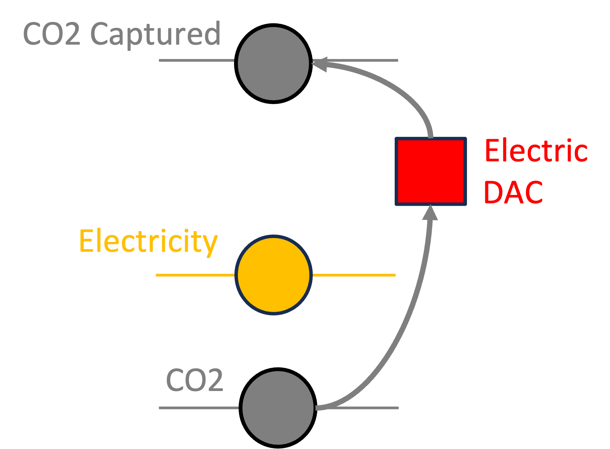
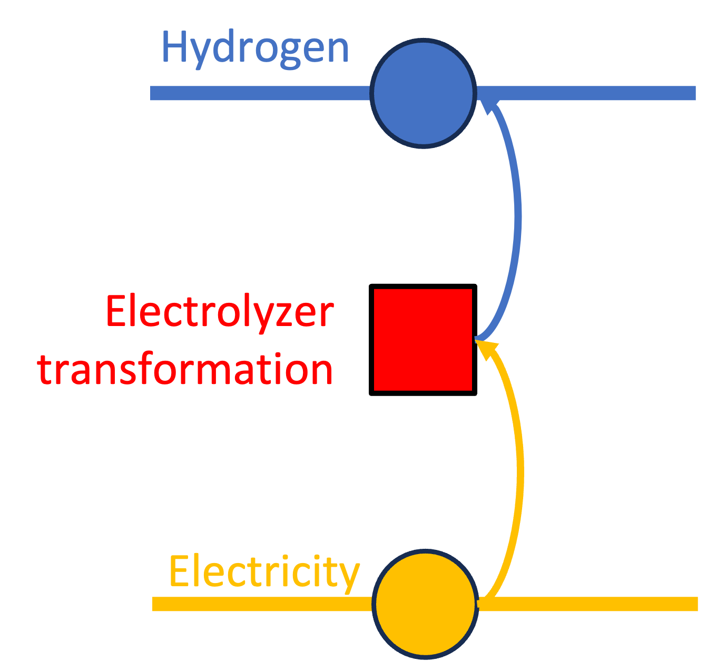
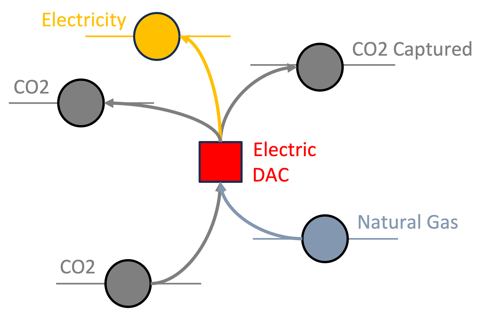

# Macro Asset Library

Macro is designed to be a flexible and modular model that can adapt to various energy system representations. The model provides a rich library of pre-defined assets, enabling a "plug-and-play" approach for users building their own energy system.

Each asset is defined by a **combination of transformations, edges, and storage units** that represent the physical and operational characteristics of a technology. These assets can be combined to create a detailed representation of the energy system, capturing the interactions between technologies and sectors.

In the following sections, we will introduce each asset type and show the **attributes** that can be set for each of them as well as the **equations** that define the conversion processes. We will also provide a **graphical representation** of the asset in terms of transformations, edges, and storages to help the user understand the structure of the asset.

Each section will have the following three parts:
1. **Graph structure**: a graphical representation of the asset, showing the transformations, edges, and storages present in the asset.
2. **Attributes**: a table with the attributes that can be set for each asset type.
3. **Example**: an example of the asset type input file (`.json`) that can be used to create the asset.

## Available assets
The current library includes the following assets:

- [Battery](@ref)

```@raw html
<a href="battery.html"></a>
```

- [BECCS Electricity](@ref)

```@raw html
<a href="beccselectricity.html"></a>
```

- [BECCS Hydrogen](@ref)

```@raw html
<a href="beccshydrogen.html"></a>
```

- [Electric DAC](@ref)

```@raw html
<a href="electricdac.html"></a>
```

- [Electrolyzer](@ref)

```@raw html
<a href="electrolyzer.html"></a>
```

- [Fuel Cell](@ref)

```@raw html
<a href="fuelcell.html"></a>
```

- [Gas Storage](@ref)

```@raw html
<a href="gasstorage.html"></a>
```

- [Hydrogen Line](@ref)

```@raw html
<a href="hydrogenline.html"></a>
```

- [Hydro Reservoir](@ref)

```@raw html
<a href="hydropower.html"></a>
```

- [Must Run](@ref)

```@raw html
<a href="mustrun.html"></a>
```

- [Natural Gas DAC](@ref)

```@raw html
<a href="natgasdaq.html"></a>
```

- [Power Line](@ref)

```@raw html
<a href="powerline.html"></a>
```

- [Thermal Hydrogen Plant (with and without CCS)](@ref)

```@raw html
<a href="thermalhydrogen.html"></a>
```

- [Thermal Power Plant (with and without CCS)](@ref)

```@raw html
<a href="thermalpower.html"></a>
```

- [Variable Renewable Energy resources (VRE)](@ref)

```@raw html
<a href="vre.html"></a>
```
