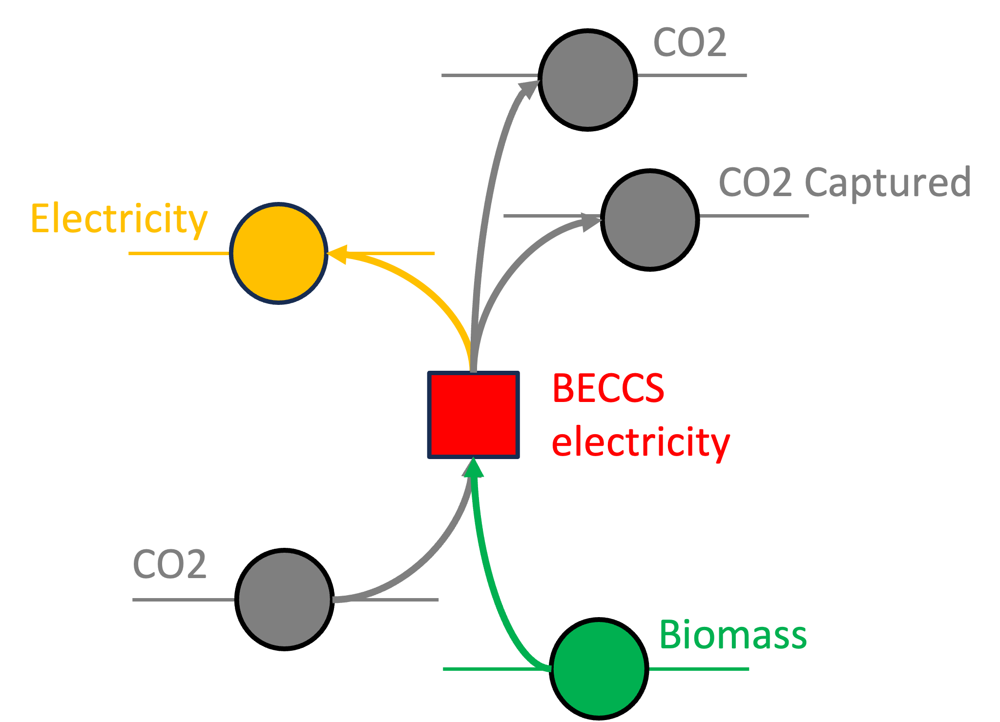

# BECCS Electricity

## Graph structure
Bioenergy with carbon capture and storage (BECCS) that produces electricity is represented in MACRO using the following graph structure:

```@raw html

```

A BECCS electricity asset is made of:

- 1 `Transformation` component, representing the BECCS process.
- 5 `Edge` components:
    - 1 **incoming** `Biomass` `Edge`, representing the biomass supply.
    - 1 **incoming** `CO2` `Edge`, representing the CO2 that is absorbed by the biomass.
    - 1 **outgoing** `Electricity` `Edge`, representing the electricity production.
    - 1 **outgoing** `CO2Captured` `Edge`, representing the CO2 that is captured.
    - 1 **outgoing** `CO2` `Edge`, representing the CO2 that is emitted.

## Attributes
The structure of the input file for a BECCS electricity asset follows the graph representation. Each `global_data` and `instance_data` will look like this:

```json
{
    "transforms":{
        // ... transformation-specific attributes ...
    },
    "edges":{
        "biomass_edge": {
            // ... biomass_edge-specific attributes ...
        },
        "co2_edge": {
            // ... co2_edge-specific attributes ...
        },
        "elec_edge": {
            // ... elec_edge-specific attributes ...
        },
        "co2_emission_edge": {
            // ... co2_emission_edge-specific attributes ...
        },
        "co2_captured_edge": {
            // ... co2_captured_edge-specific attributes ...
        }
    }
}
```
where the possible attributes that the user can set are reported in the following tables. 

### Transformation
The definition of the transformation object can be found here [Macro.Transformation](@ref).

| **Attribute** | **Type** | **Values** | **Default** | **Description/Units** |
|:--------------| :------: |:------: | :------: |:-------|
| **timedata**  | `String` | Any MACRO commodity type | Required | Time resolution for the time series data linked to the transformation. E.g. "Biomass". |
| **constraints** | `Dict{String,Bool}` | Any MACRO constraint type for vertices | Empty | List of constraints applied to the transformation. E.g. `{"BalanceConstraint": true}`. |
| **capture_rate** $\epsilon_{co2\_capture\_rate}$ | `Float64` | `Float64` | 1.0 | $t_{CO2}/t_{Biomass}$ |
| **co2_content** $\epsilon_{co2}$ | `Float64` | `Float64` | 0.0 | $t_{CO2}/t_{Biomass}$ |
| **electricity_production** $\epsilon_{elec\_prod}$ | `Float64` | `Float64` | 1.0 | $MWh_{elec}/t_{Biomass}$ |
| **emission_rate** $\epsilon_{emission\_rate}$ | `Float64` | `Float64` | 1.0 | $t_{CO2}/t_{Biomass}$ |

!!! tip "Default constraints"
    The **default constraint** for the transformation part of the BECCS electricity asset is the following:
    - [Balance constraint](@ref)

#### Flow equations
In the following equations, $\phi$ is the flow of the commodity and $\epsilon$ is the stoichiometric coefficient defined in the transformation table below.

!!! note "BECCSElectricity"
    ```math
    \begin{aligned}
    \phi_{elec} &= \phi_{biomass} \cdot \epsilon_{elec\_prod} \\
    \phi_{co2} &= -\phi_{biomass} \cdot \epsilon_{co2} \\
    \phi_{co2} &= \phi_{biomass} \cdot \epsilon_{emission\_rate} \\
    \phi_{co2\_captured} &= \phi_{biomass} \cdot \epsilon_{co2\_capture\_rate} \\
    \end{aligned}
    ```

### Edges
!!! warning "Asset expansion"
    As a modeling decision, only the `Biomass` edge is allowed to expand. Consequently, the `has_capacity` and `constraints` attributes can only be set for the `Biomass` edge. For all other edges, these attributes are pre-set to false and an empty list, respectively, to ensure proper modeling of the asset.

!!! warning "Directionality"
    The `unidirectional` attribute is only available for the `Biomass` edge. For the other edges, this attribute is pre-set to `true` to ensure the correct modeling of the asset. 

All the edges are represented by the same set of attributes. The definition of the `Edge` object can be found here [Macro.Edge](@ref).

| **Attribute** | **Type** | **Values** | **Default** | **Description** |
|:--------------| :------: |:------: | :------: |:-------|
| **type** | `String` | Any MACRO commodity type matching the commodity of the edge| Required | Commodity of the edge. E.g. "Electricity". |
| **start_vertex** | `String` | Any node id present in the system matching the commodity of the edge | Required | ID of the starting vertex of the edge. The node must be present in the `nodes.json` file. E.g. "elec\_node\_1". |
| **end_vertex** | `String` | Any node id present in the system matching the commodity of the edge | Required | ID of the ending vertex of the edge. The node must be present in the `nodes.json` file. E.g. "elec\_node\_2". |
| **constraints** | `Dict{String,Bool}` | Any MACRO constraint type for Edges | Empty | List of constraints applied to the edge. E.g. `{"CapacityConstraint": true}`. |
| **availability** | `Dict` | Availability file path and header | Empty | Path to the availability file and column name for the availability time series to link to the edge. E.g. `{"timeseries": {"path": "system/availability.csv", "header": "Availability_MW_z1"}}`.|
| **can_expand** | `Bool` | `Bool` | `false` | Whether the edge is eligible for capacity expansion. |
| **can_retire** | `Bool` | `Bool` | `false` | Whether the edge is eligible for capacity retirement. |
| **capacity_size** | `Float64` | `Float64` | `1.0` | Size of the edge capacity. |
| **existing_capacity** | `Float64` | `Float64` | `0.0` | Existing capacity of the edge in MW. |
| **fixed\_om\_cost** | `Float64` | `Float64` | `0.0` | Fixed operations and maintenance cost (USD/MW-year). |
| **has\_capacity** | `Bool` | `Bool` | `false` | Whether capacity variables are created for the edge **(only available for the `Biomass` edge)**. |
| **integer\_decisions** | `Bool` | `Bool` | `false` | Whether capacity variables are integers. |
| **investment\_cost** | `Float64` | `Float64` | `0.0` | Annualized capacity investment cost (USD/MW-year) |
| **loss\_fraction** | `Float64` | Number $\in$ [0,1] | `0.0` | Fraction of transmission loss. |
| **max\_capacity** | `Float64` | `Float64` | `Inf` | Maximum allowed capacity of the edge (MW). **Note: add the `MaxCapacityConstraint` to the constraints dictionary to activate this constraint**. |
| **min\_capacity** | `Float64` | `Float64` | `0.0` | Minimum allowed capacity of the edge (MW). **Note: add the `MinCapacityConstraint` to the constraints dictionary to activate this constraint**. |
| **min\_flow\_fraction** | `Float64` | Number $\in$ [0,1] | `0.0` | Minimum flow of the edge as a fraction of the total capacity. **Note: add the `MinFlowConstraint` to the constraints dictionary to activate this constraint**. |
| **ramp\_down\_fraction** | `Float64` | Number $\in$ [0,1] | `1.0` | Maximum decrease in flow between two time steps, reported as a fraction of the capacity. **Note: add the `RampingLimitConstraint` to the constraints dictionary to activate this constraint**. |
| **ramp\_up\_fraction** | `Float64` | Number $\in$ [0,1] | `1.0` | Maximum increase in flow between two time steps, reported as a fraction of the capacity. **Note: add the `RampingLimitConstraint` to the constraints dictionary to activate this constraint**. |
| **unidirectional** | `Bool` | `Bool` | `false` | Whether the edge is unidirectional **(only available for the `Biomass` edge)**. |
| **variable\_om\_cost** | `Float64` | `Float64` | `0.0` | Variable operation and maintenance cost (USD/MWh). |

!!! tip "Default constraints"
    The only **default constraint** for the edges of the BECCS electricity asset is the [Capacity constraint](@ref) applied to the `Biomass` edge. 

## Example
The following is an example of the input file for a BECCS electricity asset that creates six BECCS electricity assets, two in each of the SE, MIDAT and NE regions.

```json
{
    "BECCS_Electricity": [
        {
            "type": "BECCSElectricity",
            "global_data": {
                "transforms": {
                    "timedata": "Biomass",
                    "constraints": {
                        "BalanceConstraint": true
                    }
                },
                "edges": {
                    "elec_edge": {
                        "type": "Electricity",
                        "unidirectional": true,
                        "has_capacity": false
                    },
                    "biomass_edge": {
                        "type": "Biomass",
                        "unidirectional": true,
                        "has_capacity": true,
                        "can_expand": true,
                        "can_retire": true,
                        "integer_decisions": false,
                        "constraints": {
                            "CapacityConstraint": true,
                            "MinFlowConstraint": true
                        }
                    },
                    "co2_edge": {
                        "type": "CO2",
                        "unidirectional": true,
                        "has_capacity": false,
                        "start_vertex": "co2_sink"
                    },
                    "co2_emission_edge": {
                        "type": "CO2",
                        "unidirectional": true,
                        "has_capacity": false,
                        "end_vertex": "co2_sink"
                    },
                    "co2_captured_edge": {
                        "type": "CO2Captured",
                        "unidirectional": true,
                        "has_capacity": false,
                        "end_vertex": "co2_captured_sink"
                    }
                }
            },
            "instance_data": [
                {
                    "id": "SE_BECCS_Electricity_Herb",
                    "transforms": {
                        "electricity_production": 1.656626506,
                        "capture_rate": 1.5313914,
                        "co2_content": 1.76022,
                        "emission_rate": 0.2288286
                    },
                    "edges": {
                        "biomass_edge": {
                            "start_vertex": "bioherb_SE",
                            "availability": {
                                "timeseries": {
                                    "path": "assets/availability.csv",
                                    "header": "SE_BECCS_Electricity_Herb"
                                }
                            },
                            "investment_cost": 696050.2868,
                            "fixed_om_cost": 193228.9157,
                            "variable_om_cost": 42.93975904,
                            "capacity_size": 400,
                            "min_flow_fraction": 0.4
                        },
                        "elec_edge": {
                            "end_vertex": "elec_SE"
                        }
                    }
                },
                {
                    "id": "MIDAT_BECCS_Electricity_Herb",
                    "transforms": {
                        "electricity_production": 1.656626506,
                        "capture_rate": 1.5313914,
                        "co2_content": 1.76022,
                        "emission_rate": 0.2288286
                    },
                    "edges": {
                        "biomass_edge": {
                            "start_vertex": "bioherb_MIDAT",
                            "availability": {
                                "timeseries": {
                                    "path": "assets/availability.csv",
                                    "header": "MIDAT_BECCS_Electricity_Herb"
                                }
                            },
                            "investment_cost": 696050.2868,
                            "fixed_om_cost": 193228.9157,
                            "variable_om_cost": 42.93975904,
                            "capacity_size": 400,
                            "min_flow_fraction": 0.4
                        },
                        "elec_edge": {
                            "end_vertex": "elec_MIDAT"
                        }
                    }
                },
                {
                    "id": "NE_BECCS_Electricity_Herb",
                    "transforms": {
                        "electricity_production": 1.656626506,
                        "capture_rate": 1.5313914,
                        "co2_content": 1.76022,
                        "emission_rate": 0.2288286
                    },
                    "edges": {
                        "biomass_edge": {
                            "start_vertex": "bioherb_NE",
                            "availability": {
                                "timeseries": {
                                    "path": "assets/availability.csv",
                                    "header": "NE_BECCS_Electricity_Herb"
                                }
                            },
                            "investment_cost": 696050.2868,
                            "fixed_om_cost": 193228.9157,
                            "variable_om_cost": 42.93975904,
                            "capacity_size": 400,
                            "min_flow_fraction": 0.4
                        },
                        "elec_edge": {
                            "end_vertex": "elec_NE"
                        }
                    }
                },
                {
                    "id": "SE_BECCS_Electricity_Wood",
                    "transforms": {
                        "electricity_production": 1.656626506,
                        "capture_rate": 1.5313914,
                        "co2_content": 1.76022,
                        "emission_rate": 0.2288286
                    },
                    "edges": {
                        "biomass_edge": {
                            "start_vertex": "biowood_SE",
                            "availability": {
                                "timeseries": {
                                    "path": "assets/availability.csv",
                                    "header": "SE_BECCS_Electricity_Wood"
                                }
                            },
                            "investment_cost": 696050.2868,
                            "fixed_om_cost": 193228.9157,
                            "variable_om_cost": 42.93975904,
                            "capacity_size": 400,
                            "min_flow_fraction": 0.4
                        },
                        "elec_edge": {
                            "end_vertex": "elec_SE"
                        }
                    }
                },
                {
                    "id": "MIDAT_BECCS_Electricity_Wood",
                    "transforms": {
                        "electricity_production": 1.656626506,
                        "capture_rate": 1.5313914,
                        "co2_content": 1.76022,
                        "emission_rate": 0.2288286
                    },
                    "edges": {
                        "biomass_edge": {
                            "start_vertex": "biowood_MIDAT",
                            "availability": {
                                "timeseries": {
                                    "path": "assets/availability.csv",
                                    "header": "MIDAT_BECCS_Electricity_Wood"
                                }
                            },
                            "investment_cost": 696050.2868,
                            "fixed_om_cost": 193228.9157,
                            "variable_om_cost": 42.93975904,
                            "capacity_size": 400,
                            "min_flow_fraction": 0.4
                        },
                        "elec_edge": {
                            "end_vertex": "elec_MIDAT"
                        }
                    }
                },
                {
                    "id": "NE_BECCS_Electricity_Wood",
                    "transforms": {
                        "electricity_production": 1.656626506,
                        "capture_rate": 1.5313914,
                        "co2_content": 1.76022,
                        "emission_rate": 0.2288286
                    },
                    "edges": {
                        "biomass_edge": {
                            "start_vertex": "biowood_NE",
                            "availability": {
                                "timeseries": {
                                    "path": "assets/availability.csv",
                                    "header": "NE_BECCS_Electricity_Wood"
                                }
                            },
                            "investment_cost": 696050.2868,
                            "fixed_om_cost": 193228.9157,
                            "variable_om_cost": 42.93975904,
                            "capacity_size": 400,
                            "min_flow_fraction": 0.4
                        },
                        "elec_edge": {
                            "end_vertex": "elec_NE"
                        }
                    }
                }
            ]
        }
    ]
}
```