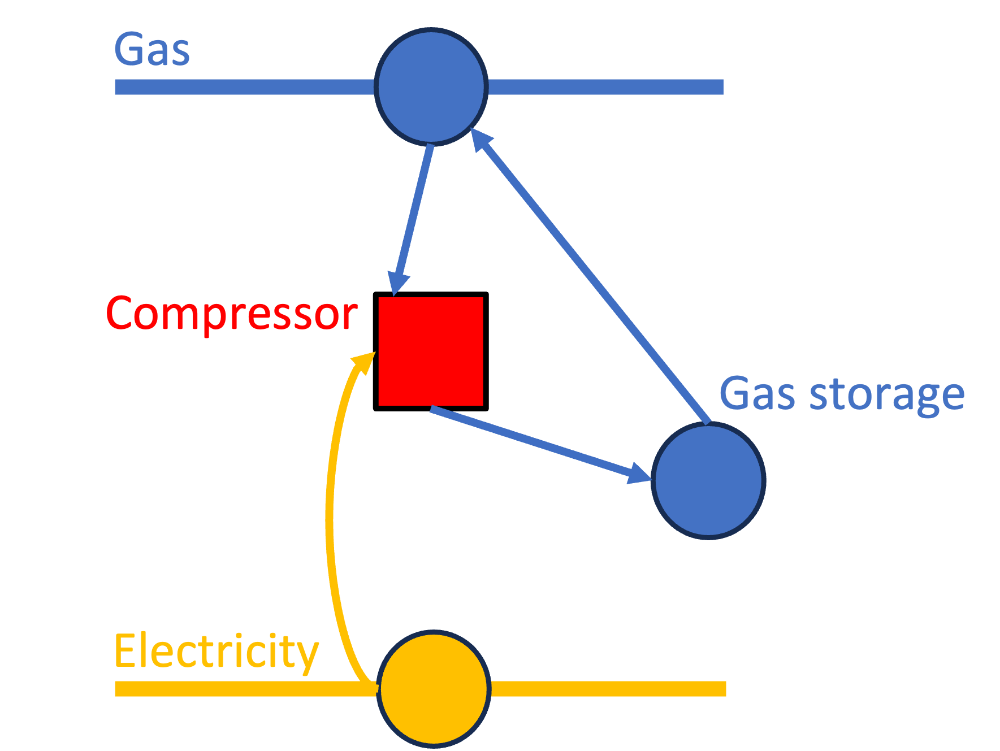

# Gas Storage

## Graph structure
A storage for a gas commodity is represented in Macro using the following graph structure:

```@raw html

```

A gas storage asset is made of:

- 1 `Storage` component, representing the gas storage process. The gas type is set using the `commodity` attribute (see table below).
- 1 `Transformation` component, representing the gas compressor.
- 4 `Edge` components:
    - 1 **incoming** `Electricity` `Edge`, representing the electricity consumption for powering the compressor.
    - 1 **incoming** `Gas` `Edge`, representing the gas flow into the storage asset through the compressor.
    - 1 **internal** `Gas` `Edge`, representing the gas flow between the compressor and the storage. This can be seen as a charge edge for the storage component.
    - 1 **outgoing** `Gas` `Edge`, representing the discharged edge of the gas storage.

## Attributes
The structure of the input file for a gas storage asset follows the graph representation. Each `global_data` and `instance_data` will look like this:

```json
{
    "transforms":{
        // ... transformation-specific attributes ...
    },
    "edges":{
        "compressor_elec_edge": {
            // ... compressor_elec_edge-specific attributes ...
        },
        "compressor_gas_edge": {
            // ... compressor_gas_edge-specific attributes ...
        },
        "charge_edge": {
            // ... storage_gas_edge-specific attributes ...
        },
        "discharge_edge": {
            // ... discharge_gas_edge-specific attributes ...
        }
    },
    "storage":{
        // ... storage-specific attributes ...
    }
}
```

### Transformation
The definition of the transformation object can be found here [MacroEnergy.Transformation](@ref).

| **Attribute** | **Type** | **Values** | **Default** | **Description** |
|:--------------| :------: | :------: | :------: |:-------|
| **timedata** | `String` | `String` | Required | Time resolution for the time series data linked to the transformation. E.g. "Hydrogen". |
| **constraints** | `Dict{String,Bool}` | Any Macro constraint type for vertices | `BalanceConstraint` | List of constraints applied to the transformation. E.g. `{"BalanceConstraint": true}`. |
| **electricity_consumption** $\epsilon_{elec\_consumption}$ | `Float64` | `Float64` | `0.0` | $MWh_{elec}/MWh_{gas}$ |

#### Flow equations
In the following equations, $\phi$ is the flow of the commodity and $\epsilon$ is the stoichiometric coefficient defined in the transformation table below.

!!! note "GasStorage"
    **Note**: `c` is the type of the commodity being stored.
    The following equation is related to the compressor.
    ```math
    \begin{aligned}
    \phi_{elec} &= \phi_{c} \cdot \epsilon_{elec\_consumption} \\
    \end{aligned}
    ```
    Look also at the "Efficiency" tip below for more information on the efficiency of charging/discharging process.

### Edges
All the edges are represented by the same set of attributes. The definition of the `Edge` object can be found here [MacroEnergy.Edge](@ref).

| **Attribute** | **Type** | **Values** | **Default** | **Description** |
|:--------------| :------: |:------: | :------: |:-------|
| **type** | `String` | Any Macro commodity type matching the commodity of the edge | Required | Commodity of the edge. E.g. "Electricity". |
| **start_vertex** | `String` | Any node id present in the system matching the commodity of the edge | Required | ID of the starting vertex of the edge. The node must be present in the `nodes.json` file. E.g. "elec\_node\_1". |
| **end_vertex** | `String` | Any node id present in the system matching the commodity of the edge | Required | ID of the ending vertex of the edge. The node must be present in the `nodes.json` file. E.g. "elec\_node\_2". |
| **constraints** | `Dict{String,Bool}` | Any Macro constraint type for Edges | Check box below | List of constraints applied to the edge. E.g. `{"CapacityConstraint": true}`.|
| **availability** | `Dict` | Availability file path and header | Empty | Path to the availability file and column name for the availability time series to link to the edge. E.g. `{"timeseries": {"path": "assets/availability.csv", "header": "SE_Above_ground_storage"}}`.|
| **can_expand** | `Bool` | `Bool` | `false` | Whether the edge is eligible for capacity expansion. |
| **can_retire** | `Bool` | `Bool` | `false` | Whether the edge is eligible for capacity retirement. |
| **capacity_size** | `Float64` | `Float64` | `1.0` | Size of the edge capacity. |
| **efficiency** | `Float64` | Number $\in$ [0,1] | `1.0` | Efficiency of the charging/discharging process. |
| **existing_capacity** | `Float64` | `Float64` | `0.0` | Existing capacity of the edge in MW. |
| **fixed\_om\_cost** | `Float64` | `Float64` | `0.0` | Fixed operations and maintenance cost (USD/MW-year). |
| **has\_capacity** | `Bool` | `Bool` | `false` | Whether capacity variables are created for the edge. |
| **integer\_decisions** | `Bool` | `Bool` | `false` | Whether capacity variables are integers. |
| **investment\_cost** | `Float64` | `Float64` | `0.0` | Annualized capacity investment cost (USD/MW-year) |
| **loss\_fraction** | `Float64` | Number $\in$ [0,1] | `0.0` | Fraction of transmission loss. |
| **max\_capacity** | `Float64` | `Float64` | `Inf` | Maximum allowed capacity of the edge (MW). **Note: add the `MaxCapacityConstraint` to the constraints dictionary to activate this constraint**. |
| **min\_capacity** | `Float64` | `Float64` | `0.0` | Minimum allowed capacity of the edge (MW). **Note: add the `MinCapacityConstraint` to the constraints dictionary to activate this constraint**. |
| **min\_flow\_fraction** | `Float64` | Number $\in$ [0,1] | `0.0` | Minimum flow of the edge as a fraction of the total capacity. **Note: add the `MinFlowConstraint` to the constraints dictionary to activate this constraint**. |
| **ramp\_down\_fraction** | `Float64` | Number $\in$ [0,1] | `1.0` | Maximum decrease in flow between two time steps, reported as a fraction of the capacity. **Note: add the `RampingLimitConstraint` to the constraints dictionary to activate this constraint**. |
| **ramp\_up\_fraction** | `Float64` | Number $\in$ [0,1] | `1.0` | Maximum increase in flow between two time steps, reported as a fraction of the capacity. **Note: add the `RampingLimitConstraint` to the constraints dictionary to activate this constraint**. |
| **variable\_om\_cost** | `Float64` | `Float64` | `0.0` | Variable operation and maintenance cost (USD/MWh). |

!!! tip "Efficiency"
    The efficiency of the charging/discharging process can be set in the `charge_edge` and `discharge_edge` parts of the input file. These parameters are used, for example, in the [Balance constraint](@ref) to balance the charge and discharge flows. 

!!! tip "Default constraints"
    The only **default constraint** for the edges of the gas storage asset is the [Capacity constraint](@ref) applied to both the charge and discharge edges.

### Storage component
The definition of the `Storage` object can be found here [MacroEnergy.Storage](@ref).

| **Attribute** | **Type** | **Values** | **Default** | **Description** |
|:--------------| :------: |:------: | :------: |:-------|
| **commodity** | `String` | Any Macro commodity type | Required | Commodity being stored. E.g. "Hydrogen". |
| **constraints** | `Dict{String,Bool}` | Any Macro constraint type for storage | `BalanceConstraint`, `StorageCapacityConstraint` | List of constraints applied to the storage. E.g. `{"BalanceConstraint": true}`. |
| **can_expand** | `Bool` | `Bool` | `false` | Whether the storage is eligible for capacity expansion. |
| **can\_retire** | `Bool` | `Bool` | `false` | Whether the storage is eligible for capacity retirement. |
| **charge\_discharge\_ratio** | `Float64` | `Float64` | `1.0` | Ratio between charging and discharging rates. |
| **existing\_capacity\_storage** | `Float64` | `Float64` | `0.0` | Initial installed storage capacity (MWh). |
| **fixed\_om\_cost\_storage** | `Float64` | `Float64` | `0.0` | Fixed operations and maintenance cost (USD/MWh-year). |
| **investment\_cost\_storage** | `Float64` | `Float64` | `0.0` | Annualized investment cost of the energy capacity for a storage technology (USD/MWh-year). |
| **long\_duration** | `Bool` | `Bool` | `false` | Whether the storage is a long-duration storage. **Note**: if `true`, the long-duration storage constraint will be applied. |
| **max\_capacity\_storage** | `Float64` | `Float64` | `Inf` | Maximum allowed storage capacity (MWh). |
| **max\_duration** | `Float64` | `Float64` | `0.0` | Maximum ratio of installed energy to discharged capacity that can be installed (hours).|
| **min\_capacity\_storage** | `Float64` | `Float64` | `0.0` | Minimum allowed storage capacity (MWh). |
| **min\_duration** | `Float64` | `Float64` | `0.0` | Minimum ratio of installed energy to discharged capacity that can be installed (hours).|
| **min\_outflow\_fraction** | `Float64` | `Float64` | `0.0` | Minimum outflow as a fraction of capacity. |
| **min\_storage\_level** | `Float64` | `Float64` | `0.0` | Minimum storage level as a fraction of capacity. |
| **max\_storage\_level** | `Float64` | `Float64` | `1.0` | Maximum storage level as a fraction of capacity. |
| **storage\_loss\_fraction** | `Float64` | Number $\in$ [0,1] | `0.0` | Fraction of stored commodity lost per timestep. |

!!! tip "Default constraints"
    As noted in the above table, the **default constraints** for the storage component of the gas storage are the following:

    - [Balance constraint](@ref)
    - [Storage capacity constraint](@ref)

    If the storage is a long-duration storage, the following additional constraints are applied:
    - [Long-duration storage constraints](@ref)

## Example
The following input file example shows how to create a hydrogen storage asset in each of the three zones SE, MIDAT and NE.
```json
{
    "h2stor": [
        {
            "type": "GasStorage",
            "global_data": {
                "nodes": {},
                "transforms": {
                    "timedata": "Hydrogen",
                    "constraints": {
                        "BalanceConstraint": true
                    }
                },
                "edges": {
                    "discharge_edge": {
                        "type": "Hydrogen",
                        "unidirectional": true,
                        "can_expand": true,
                        "can_retire": false,
                        "has_capacity": true,
                        "constraints": {
                            "CapacityConstraint": true,
                            "RampingLimitConstraint": true
                        }
                    },
                    "charge_edge": {
                        "type": "Hydrogen",
                        "unidirectional": true,
                        "has_capacity": true,
                        "can_expand": true,
                        "can_retire": false,
                        "constraints": {
                            "CapacityConstraint": true
                        }
                    },
                    "compressor_elec_edge": {
                        "type": "Electricity",
                        "unidirectional": true,
                        "has_capacity": false
                    },
                    "compressor_gas_edge": {
                        "type": "Hydrogen",
                        "unidirectional": true,
                        "has_capacity": false
                    }
                },
                "storage": {
                    "commodity": "Hydrogen",
                    "can_expand": true,
                    "can_retire": false,
                    "constraints": {
                        "StorageCapacityConstraint": true,
                        "BalanceConstraint": true,
                        "MinStorageLevelConstraint": true
                    }
                }
            },
            "instance_data": [
                {
                    "id": "SE_Above_ground_storage",
                    "transforms": {
                        "electricity_consumption": 0.018029457
                    },
                    "edges": {
                        "discharge_edge": {
                            "end_vertex": "h2_SE",
                            "existing_capacity": 0,
                            "investment_cost": 0.0,
                            "fixed_om_cost": 0.0,
                            "variable_om_cost": 0.0,
                            "efficiency": 1.0,
                            "ramp_up_fraction": 1,
                            "ramp_down_fraction": 1
                        },
                        "charge_edge": {
                            "existing_capacity": 0,
                            "investment_cost": 3219.236569,
                            "fixed_om_cost": 0.0,
                            "variable_om_cost": 0.0,
                            "efficiency": 1.0
                        },
                        "compressor_gas_edge": {
                            "start_vertex": "h2_SE"
                        },
                        "compressor_elec_edge": {
                            "start_vertex": "elec_SE"
                        }
                    },
                    "storage": {
                        "investment_cost_storage": 873.013307,
                        "fixed_om_cost_storage": 28.75810056,
                        "storage_loss_fraction": 0.0,
                        "min_storage_level": 0.3
                    }
                },
                {
                    "id": "MIDAT_Above_ground_storage",
                    "transforms": {
                        "electricity_consumption": 0.018029457
                    },
                    "edges": {
                        "discharge_edge": {
                            "end_vertex": "h2_MIDAT",
                            "existing_capacity": 0,
                            "investment_cost": 0.0,
                            "fixed_om_cost": 0.0,
                            "variable_om_cost": 0.0,
                            "efficiency": 1.0,
                            "ramp_up_fraction": 1,
                            "ramp_down_fraction": 1
                        },
                        "charge_edge": {
                            "existing_capacity": 0,
                            "investment_cost": 3219.236569,
                            "fixed_om_cost": 0.0,
                            "variable_om_cost": 0.0,
                            "efficiency": 1.0
                        },
                        "compressor_gas_edge": {
                            "start_vertex": "h2_MIDAT"
                        },
                        "compressor_elec_edge": {
                            "start_vertex": "elec_MIDAT"
                        }
                    },
                    "storage": {
                        "investment_cost_storage": 873.013307,
                        "fixed_om_cost_storage": 28.75810056,
                        "storage_loss_fraction": 0.0,
                        "min_storage_level": 0.3
                    }
                },
                {
                    "id": "NE_Above_ground_storage",
                    "transforms": {
                        "electricity_consumption": 0.018029457
                    },
                    "edges": {
                        "discharge_edge": {
                            "end_vertex": "h2_NE",
                            "existing_capacity": 0,
                            "investment_cost": 0.0,
                            "fixed_om_cost": 0.0,
                            "variable_om_cost": 0.0,
                            "efficiency": 1.0,
                            "ramp_up_fraction": 1,
                            "ramp_down_fraction": 1
                        },
                        "charge_edge": {
                            "existing_capacity": 0,
                            "investment_cost": 3219.236569,
                            "fixed_om_cost": 0.0,
                            "variable_om_cost": 0.0,
                            "efficiency": 1.0
                        },
                        "compressor_gas_edge": {
                            "start_vertex": "h2_NE"
                        },
                        "compressor_elec_edge": {
                            "start_vertex": "elec_NE"
                        }
                    },
                    "storage": {
                        "investment_cost_storage": 873.013307,
                        "fixed_om_cost_storage": 28.75810056,
                        "storage_loss_fraction": 0.0,
                        "min_storage_level": 0.3
                    }
                }
            ]
        }
    ]
}
```