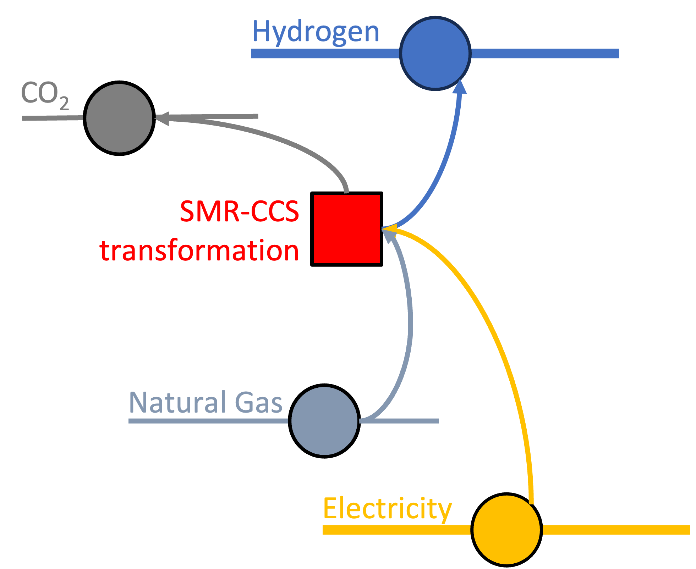

# Thermal Hydrogen Plant (with and without CCS)

## Graph structure
A thermal hydrogen plant (with and without CCS) is represented in Macro using the following graph structure:

```@raw html

```

A thermal hydrogen plant (with and without CCS) is made of:
- 1 `Transformation` component, representing the thermal hydrogen plant (with and without CCS).
- 5 `Edge` components:
    - 1 **incoming** `Fuel` `Edge`, representing the fuel supply. 
    - 1 **incoming** `Electricity` `Edge`, representing the electricity consumption.
    - 1 **outgoing** `Hydrogen` `Edge`, representing the hydrogen production. **This edge can have unit commitment operations**.
    - 1 **outgoing** `CO2` `Edge`, representing the CO2 that is emitted.
    - 1 **outgoing** `CO2Captured` `Edge`, representing the CO2 that is captured **(only if CCS is present)**.

## Attributes
The structure of the input file for a ThermalHydrogen asset follows the graph representation. Each `global_data` and `instance_data` will look like this:

```json
{
    "transforms":{
        // ... transformation-specific attributes ...
    },
    "edges":{
        "fuel_edge": {
            // ... fuel_edge-specific attributes ...
        },
        "elec_edge": {
            // ... elec_edge-specific attributes ...
        },
        "h2_edge": {
            // ... h2_edge-specific attributes ...
        },
        "co2_edge": {
            // ... co2_edge-specific attributes ...
        },
        "co2_captured_edge": {
            // ... co2_captured_edge-specific attributes, only if CCS is present ...
        }
    }
}
```

### Transformation
The definition of the transformation object can be found here [MacroEnergy.Transformation](@ref).

| **Attribute** | **Type** | **Values** | **Default** | **Description/Units** |
|:--------------| ::------: | :------: | :------: |:-------|
| **timedata** | `String` | `String` | Required | Time resolution for the time series data linked to the transformation. E.g. "NaturalGas". |
| **constraints** | `Dict{String,Bool}` | Any Macro constraint type for vertices| `BalanceConstraint` | List of constraints applied to the transformation. E.g. `{"BalanceConstraint": true}`. |
| **electricity_consumption** $\epsilon_{elec\_consumption}$ | `Float64` | `Float64` | 0.0 | $MWh_{elec}/MWh_{h2}$ |
| **fuel_consumption** $\epsilon_{fuel\_consumption}$ | `Float64` | `Float64` | 1.0 | $MWh_{fuel}/MWh_{h2}$|
| **emission_rate** $\epsilon_{emission\_rate}$ | `Float64` | `Float64` | 0.0 | $t_{CO2}/MWh_{fuel}$ |
| **capture_rate** $\epsilon_{co2\_capture\_rate}$ | `Float64` | `Float64` | 0.0 | $t_{CO2}/MWh_{fuel}$ |

!!! tip "Default constraints"
    The **default constraint** for the transformation part of the ThermalHydrogen asset is the following:
    - [Balance constraint](@ref)

#### Flow equations
In the following equations, $\phi$ is the flow of the commodity and $\epsilon$ is the stoichiometric coefficient defined in the transformation table below.

!!! note "ThermalHydrogen"
    **Note**: Fuel is the type of the fuel being converted.
    ```math
    \begin{aligned}
    \phi_{fuel} &= \phi_{h2} \cdot \epsilon_{fuel\_consumption} \\
    \phi_{elec} &= \phi_{h2} \cdot \epsilon_{elec\_consumption} \\
    \phi_{co2} &= \phi_{fuel} \cdot \epsilon_{emission\_rate} \\
    \phi_{co2\_captured} &= \phi_{fuel} \cdot \epsilon_{co2\_capture\_rate} \quad \text{(if CCS)} \\
    \end{aligned}
    ```

### Edges
!!! note "Unit commitment and default constraints"
    The `Hydrogen` edge **can have unit commitment operations**. To enable it, the user needs to set the `uc` attribute to `true`. The default constraints for unit commitment case are the following:
    - [Capacity constraint](@ref)
    - [Ramping limits constraint](@ref)
    - [Minimum up and down time constraint](@ref)

    In case of no unit commitment, the `uc` attribute is set to `false` and the default constraints are the following:
    - [Capacity constraint](@ref)

!!! warning "Asset expansion"
    As a modeling decision, only the `Hydrogen` and `Fuel` edges are allowed to expand. Therefore, both the `has_capacity` and `constraints` attributes can only be set for those edges. For all the other edges, these attributes are pre-set to `false` and to an empty list respectively to ensure the correct modeling of the asset. 

!!! warning "Directionality"
    The `unidirectional` attribute is set to `true` for all the edges.


All the edges are represented by the same set of attributes. The definition of the `Edge` object can be found here [MacroEnergy.Edge](@ref).

| **Attribute** | **Type** | **Values** | **Default** | **Description** |
|:--------------| :------: |:------: | :------: |:-------|
| **type** | `String` | Any Macro commodity type matching the commodity of the edge | Required | Commodity of the edge. E.g. "Hydrogen". |
| **start_vertex** | `String` | Any node id present in the system matching the commodity of the edge | Required | ID of the starting vertex of the edge. The node must be present in the `nodes.json` file. E.g. "elec\_node\_1". |
| **end_vertex** | `String` | Any node id present in the system matching the commodity of the edge | Required | ID of the ending vertex of the edge. The node must be present in the `nodes.json` file. E.g. "elec\_node\_2". |
| **constraints** | `Dict{String,Bool}` | Any Macro constraint type for Edges | See note above | List of constraints applied to the edge. E.g. `{"CapacityConstraint": true}`. |
| **availability** | `Dict` | Availability file path and header | Empty | Path to the availability file and column name for the availability time series to link to the edge. E.g. `{"timeseries": {"path": "assets/availability.csv", "header": "SE_ATR_wCCS"}}`.|
| **can_expand** | `Bool` | `Bool` | `false` | Whether the edge is eligible for capacity expansion. |
| **can_retire** | `Bool` | `Bool` | `false` | Whether the edge is eligible for capacity retirement. |
| **capacity_size** | `Float64` | `Float64` | `1.0` | Size of the edge capacity. |
| **existing_capacity** | `Float64` | `Float64` | `0.0` | Existing capacity of the edge in MW. |
| **fixed\_om\_cost** | `Float64` | `Float64` | `0.0` | Fixed operations and maintenance cost (USD/MW-year). |
| **has\_capacity** | `Bool` | `Bool` | `false` | Whether capacity variables are created for the edge **(only available for the `Hydrogen` and `Fuel` edges)**. |
| **integer\_decisions** | `Bool` | `Bool` | `false` | Whether capacity variables are integers. |
| **investment\_cost** | `Float64` | `Float64` | `0.0` | Annualized capacity investment cost (USD/MW-year) |
| **loss\_fraction** | `Float64` | Number $\in$ [0,1] | `0.0` | Fraction of transmission loss. |
| **max\_capacity** | `Float64` | `Float64` | `Inf` | Maximum allowed capacity of the edge (MW). **Note: add the `MaxCapacityConstraint` to the constraints dictionary to activate this constraint**. |
| **min\_capacity** | `Float64` | `Float64` | `0.0` | Minimum allowed capacity of the edge (MW). **Note: add the `MinCapacityConstraint` to the constraints dictionary to activate this constraint**. |
| **min\_flow\_fraction** | `Float64` | Number $\in$ [0,1] | `0.0` | Minimum flow of the edge as a fraction of the total capacity. **Note: add the `MinFlowConstraint` to the constraints dictionary to activate this constraint**. |
| **min\_down\_time** | `Int64` | `Int64` | `0` | Minimum amount of time the edge has to remain in the shutdown state before starting up again. **Note: add the `MinDownTimeConstraint` to the constraints dictionary to activate this constraint**. |
| **min\_up\_time** | `Int64` | `Int64` | `0` | Minimum amount of time the edge has to remain in the committed state. **Note: add the `MinUpTimeConstraint` to the constraints dictionary to activate this constraint**. |
| **ramp\_down\_fraction** | `Float64` | Number $\in$ [0,1] | `1.0` | Maximum decrease in flow between two time steps, reported as a fraction of the capacity. **Note: add the `RampingLimitConstraint` to the constraints dictionary to activate this constraint**. |
| **ramp\_up\_fraction** | `Float64` | Number $\in$ [0,1] | `1.0` | Maximum increase in flow between two time steps, reported as a fraction of the capacity. **Note: add the `RampingLimitConstraint` to the constraints dictionary to activate this constraint**. |
| **startup\_cost** | `Float64` | `Float64` | `0.0` | Cost per MW of capacity to start a generator (USD/MW per start). |
| **startup\_fuel** | `Float64` | `Float64` | `0.0` | Startup fuel use per MW of capacity (MWh/MW per start). |
| **uc** | `Bool` | `Bool` | `false` | Whether the edge has unit commitment operations. |
| **variable\_om\_cost** | `Float64` | `Float64` | `0.0` | Variable operation and maintenance cost (USD/MWh). |

## Example
The following is an example of the input file for a ThermalHydrogenCCS asset that creates three ThermalHydrogenCCS assets, one in each of the SE, MIDAT and NE regions.

```json
{
    "NaturalGasH2ATRCCS": [
        {
            "type": "ThermalHydrogenCCS",
            "global_data": {
                "transforms": {
                    "timedata": "NaturalGas",
                    "constraints": {
                        "BalanceConstraint": true
                    }
                },
                "edges": {
                    "h2_edge": {
                        "type": "Hydrogen",
                        "unidirectional": true,
                        "has_capacity": true,
                        "can_retire": true,
                        "can_expand": true,
                        "integer_decisions": false,
                        "uc": true,
                        "constraints": {
                            "CapacityConstraint": true,
                            "RampingLimitConstraint": true,
                            "MinFlowConstraint": true,
                            "MinUpTimeConstraint": true,
                            "MinDownTimeConstraint": true
                        }
                    },
                    "fuel_edge": {
                        "type": "NaturalGas",
                        "unidirectional": true,
                        "has_capacity": false
                    },
                    "co2_edge": {
                        "type": "CO2",
                        "unidirectional": true,
                        "has_capacity": false,
                        "end_vertex": "co2_sink"
                    },
                    "co2_captured_edge": {
                        "type": "CO2Captured",
                        "unidirectional": true,
                        "has_capacity": false,
                        "end_vertex": "co2_captured_sink"
                    },
                    "elec_edge": {
                        "type": "Electricity",
                        "unidirectional": true,
                        "has_capacity": false
                    }
                }
            },
            "instance_data": [
                {
                    "id": "SE_ATR_wCCS_94pct",
                    "transforms": {
                        "emission_rate": 0.003794329,
                        "fuel_consumption": 1.300184721664035,
                        "electricity_consumption": 0.101574,
                        "capture_rate": 0.065193472
                    },
                    "edges": {
                        "h2_edge": {
                            "end_vertex": "h2_SE",
                            "availability": {
                                "timeseries": {
                                    "path": "assets/availability.csv",
                                    "header": "SE_ATR_wCCS_94pct"
                                }
                            },
                            "existing_capacity": 0.0,
                            "investment_cost": 57497.91679,
                            "fixed_om_cost": 23292.27286,
                            "variable_om_cost": 9.262366684,
                            "capacity_size": 1082.95,
                            "startup_cost": 0.253936008,
                            "min_up_time": 22,
                            "min_down_time": 12,
                            "ramp_up_fraction": 0.5,
                            "ramp_down_fraction": 0.5,
                            "min_flow_fraction": 0.85
                        },
                        "fuel_edge": {
                            "start_vertex": "natgas_SE"
                        },
                        "elec_edge": {
                            "start_vertex": "elec_SE"
                        }
                    }
                },
                {
                    "id": "MIDAT_ATR_wCCS_94pct",
                    "transforms": {
                        "emission_rate": 0.003794329,
                        "fuel_consumption": 1.300184721664035,
                        "electricity_consumption": 0.101574,
                        "capture_rate": 0.065193472
                    },
                    "edges": {
                        "h2_edge": {
                            "end_vertex": "h2_MIDAT",
                            "availability": {
                                "timeseries": {
                                    "path": "assets/availability.csv",
                                    "header": "MIDAT_ATR_wCCS_94pct"
                                }
                            },
                            "existing_capacity": 0.0,
                            "investment_cost": 57497.91679,
                            "fixed_om_cost": 23292.27286,
                            "variable_om_cost": 9.262366684,
                            "capacity_size": 1082.95,
                            "startup_cost": 0.253936008,
                            "min_up_time": 22,
                            "min_down_time": 12,
                            "ramp_up_fraction": 0.5,
                            "ramp_down_fraction": 0.5,
                            "min_flow_fraction": 0.85
                        },
                        "fuel_edge": {
                            "start_vertex": "natgas_MIDAT"
                        },
                        "elec_edge": {
                            "start_vertex": "elec_MIDAT"
                        }
                    }
                },
                {
                    "id": "NE_ATR_wCCS_94pct",
                    "transforms": {
                        "emission_rate": 0.003794329,
                        "fuel_consumption": 1.300184721664035,
                        "electricity_consumption": 0.101574,
                        "capture_rate": 0.065193472
                    },
                    "edges": {
                        "h2_edge": {
                            "end_vertex": "h2_NE",
                            "availability": {
                                "timeseries": {
                                    "path": "assets/availability.csv",
                                    "header": "NE_ATR_wCCS_94pct"
                                }
                            },
                            "existing_capacity": 0.0,
                            "investment_cost": 57497.91679,
                            "fixed_om_cost": 23292.27286,
                            "variable_om_cost": 9.262366684,
                            "capacity_size": 1082.95,
                            "startup_cost": 0.253936008,
                            "min_up_time": 22,
                            "min_down_time": 12,
                            "ramp_up_fraction": 0.5,
                            "ramp_down_fraction": 0.5,
                            "min_flow_fraction": 0.85
                        },
                        "fuel_edge": {
                            "start_vertex": "natgas_NE"
                        },
                        "elec_edge": {
                            "start_vertex": "elec_NE"
                        }
                    }
                }
            ]
        }
    ]
}
``` 